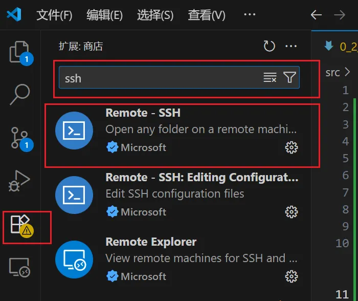
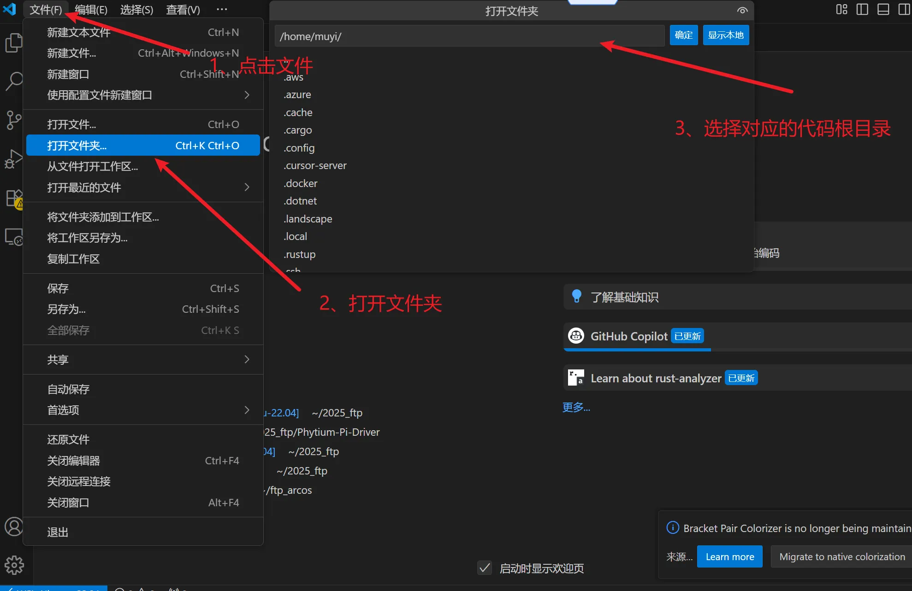
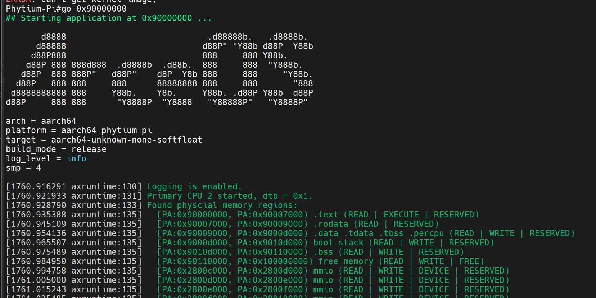

# 0.2 开发环境准备

## 0.2.1 运行环境

基础运行环境可以参考如下网址 使用wsl+qemu搭建开发环境

<https://rcore-os.cn/arceos-tutorial-book/ch01-00.html>

### vscode使用
由于使用了wsl使用的linux命令行环啊，并不是大部分人喜欢的开发环境，可以使用vscode搭配remote-ssh来进行远程的开发，并且其对于wsl是有很好的兼容性的基本安装插件后就可以使用




### qemu 补充
指导手册上使用的qemu版本是7.0.2有一些外设只有在最新版本上才能使用
所以可以直接从[qemu官网](https://www.qemu.org/download)下载最新版本
以10.0.2 版本为例子

```bash
wget https://download.qemu.org/qemu-10.0.2.tar.xz
tar xvJf qemu-10.0.2.tar.xz
cd qemu-10.0.2
make
make install
```

## 0.2.2 飞腾派上运行arceos
首先运行arceos需要依赖其他系统来提供,所以需要先烧录飞腾派系统

### 烧录飞腾派os
<https://pan.baidu.com/s/1pStiyqohrB3SxHAFFk8R6Q>  (提取码：dzdv)
> **注释：** 5-系统镜像/1-PhytiumPIOS（基于Debian）/phytiumpiosv2.1资料包/4G内存-optee版/sdcard.img.7z，解压缩。

之后使用烧录工具将系统镜像烧录到TF卡
推荐使用 balenaEtcher  下载地址 https://etcher.balena.io/
也可以使用win32 disk image 下载地址 https://sourceforge.net/projects/win32diskimager/

> **注释：** 常用的手机以及派上的小卡正式名叫做TF或者说microSD 大的是SD卡当然统称为sd卡也是可以的  具体区别可查看这个链接https://www.sd-nand.com/news/technology/312.html

之后注意引导方式选择从sd卡启动


> **注释：**  如过使用的是带emmc的版本也可以直接从emmc启动但是当前版本的麒麟os启动会禁用风扇请注意

之后上电后启动即可连接串口工具即可看到打印
账号:root
密码:root

### 编译及运行
首先快速验证可以参考这个链接

[最快速验证](https://github.com/qclic/phytium-mci/blob/main/docs/%E9%A3%9E%E8%85%BE%E6%B4%BESDMMC%E5%BC%80%E5%8F%91.md#%E6%9C%80%E7%AE%80%E4%BB%A3%E7%A0%81%E6%B5%8B%E8%AF%95%E6%96%B9%E5%BC%8F
)

下载Arceos

```bash
git clone  https://github.com/rcore-os/arceos.git
```

编译Arceos

```bash
make A=examples/helloworld ARCH=aarch64 PLATFORM=aarch64-phytium-pi  FEARURES="irq" SMP=4 LOG=info
```

之后会在example/helloword 文件夹内生成对用的可执行文件helloworld_aarch64-phytium-pi.bin
将该文件拷贝到u盘中后将u盘插入飞腾派，之后重启飞腾派并在重启过程中按enter键 进入cmd模式此时串口变为下图


执行如下指令即可在飞腾派上运行Arceos

```bash
usb start
fatload usb 0 0x90000000 helloworld_aarch64-phytium-pi.bin
go 0x90000000
```

