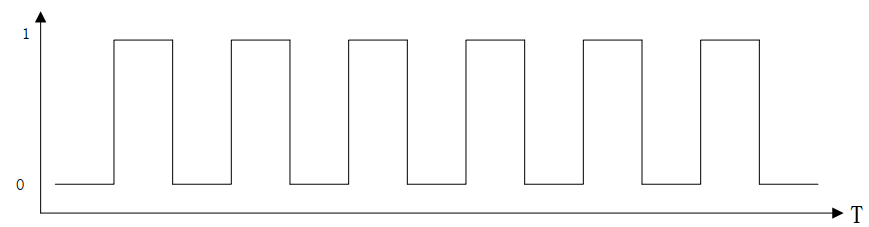

# 1.2 PWM驱动开发
## 什么是PWM？
PWM ( Pulse Width Modulation ), 称为脉宽调制

PWM 最关键的两个参数：频率和占空比。

频率是指单位时间内脉冲信号的周期数。比如开关灯，开关一次算一次周期，在 1s 进行多少次开关（开关一次为一个周期）。

占空比是指一个周期内高电平时间和低电平时间的比例。也拿开关当作例子，总共 100s，开了 50s 灯（高电平），关了 50s 灯（低电平），这时候的占空比就为 50%（比例）。

