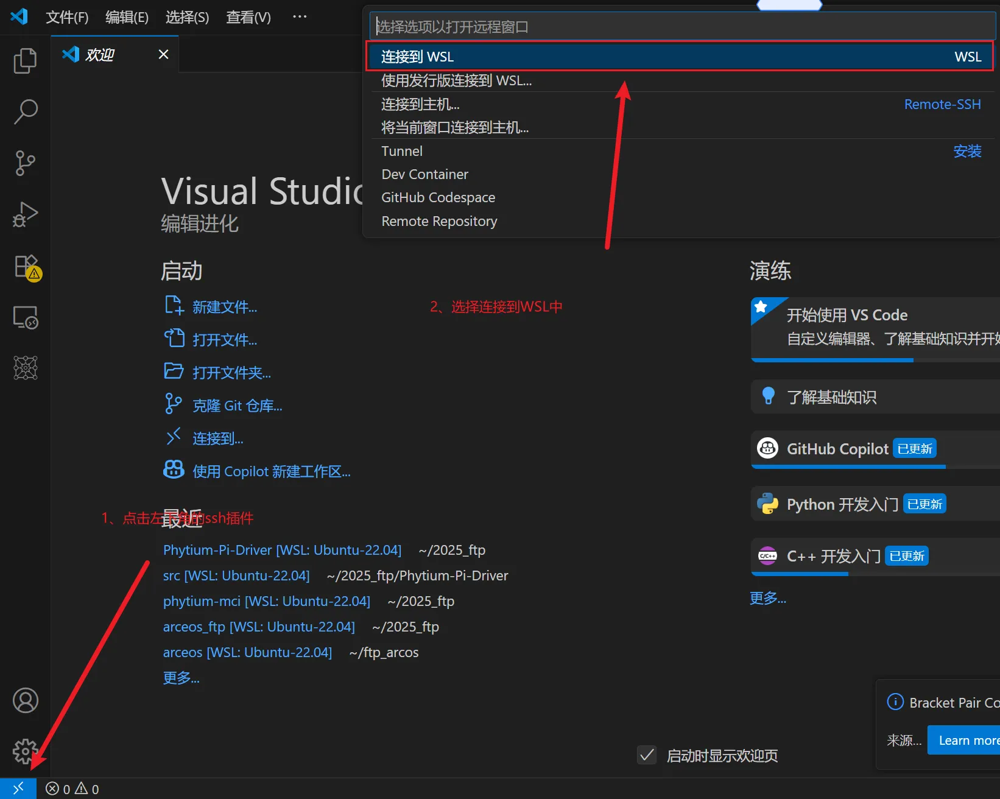
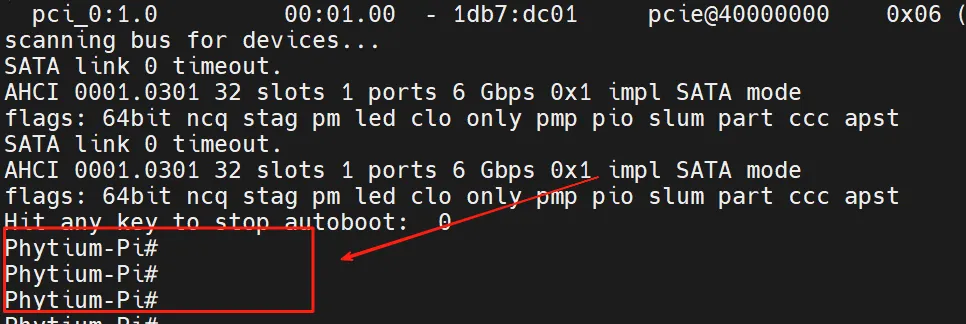

# 0.2 开发环境准备

## 0.2.1 运行环境

基础运行环境可以参考如下网址,搭建wsl+qemu的开发环境

<https://rcore-os.cn/arceos-tutorial-book/ch01-00.html>

### vscode使用
由于是使用的wsl（inux子系统）作为基础编译环境，默认提供的是命令行搭配vim的方式来编辑文件。这可能并不是大部分人喜欢的开发环境，所以推荐使用vscode搭配remote-ssh插件来进行开发，并且该插件对于wsl是有很好的兼容性的，安装插件后直接选择连接wsl即可使用。




### qemu 补充
在第一节的指导手册上使用的qemu版本是7.0.2，而很多模拟的外设是在后续版本才加到qemu中的。所以推荐从官网安装最新版或指定版本[qemu官网](https://www.qemu.org/download)

以10.0.2 版本为例子，使用如下命令即可完成qemu的安装。

```bash
wget https://download.qemu.org/qemu-10.0.2.tar.xz
tar xvJf qemu-10.0.2.tar.xz
cd qemu-10.0.2
make
make install
```

## 0.2.2 飞腾派上运行Arceos
首先运行Arceos需要依赖其他系统来提供uboot,所以运行Arceos第一步是先烧录提供的飞腾派OS。

### 烧录飞腾派OS
<https://pan.baidu.com/s/1pStiyqohrB3SxHAFFk8R6Q>  (提取码：dzdv)
> **注释：** 5-系统镜像/1-PhytiumPIOS（基于Debian）/phytiumpiosv2.1资料包/4G内存-optee版/sdcard.img.7z，解压缩。

下载解压后使用烧录工具将系统镜像烧录到TF卡，之后将TF插到飞腾派的卡槽中，最后连接电源线上电。
烧录工具推荐使用 balenaEtcher  
下载地址 https://etcher.balena.io/
也可以使用win32 disk image 
下载地址 https://sourceforge.net/projects/win32diskimager/

> **注释：** 常用的手机以及派上的小卡正式名叫做TF或者说microSD 大的是SD卡当然统称为sd卡也是可以的  具体区别可查看这个链接https://www.sd-nand.com/news/technology/312.html

注意引导方式选择从sd卡启动！！！


> **注释：**  如果使用的是带emmc的版本可以直接从emmc启动，是当前版本的麒麟os启动会禁用风扇请注意，过热可能会损坏飞腾派。

启动后连接串口，可以看到如下打印即说明系统成功启动，

账号:root
密码:root

### 编译及运行
首先快速验证请参考这个链接，可以通过ostool来快速验证当前开发环境是完整可用的，避免后面在进行了较多code后因为难以验证而放弃。

[最快速验证](https://github.com/qclic/phytium-mci/blob/main/docs/%E9%A3%9E%E8%85%BE%E6%B4%BESDMMC%E5%BC%80%E5%8F%91.md#%E6%9C%80%E7%AE%80%E4%BB%A3%E7%A0%81%E6%B5%8B%E8%AF%95%E6%96%B9%E5%BC%8F
)

下载Arceos

```bash
git clone  https://github.com/rcore-os/arceos.git
```

编译Arceos

```bash
make A=examples/helloworld ARCH=aarch64 PLATFORM=aarch64-phytium-pi  FEARURES="irq" SMP=4 LOG=info
```

之后会在example/helloword 文件夹内生成对应的可执行文件helloworld_aarch64-phytium-pi.bin
将该文件拷贝到u盘中后将u盘插入飞腾派，之后重启飞腾派并在重启过程中在串口工具中输入enter以进入cmd模式，成功进入后串口打印如下图所示。


执行如下指令即可将本地编译的Arceos部署到飞腾派上运行

```bash
usb start
fatload usb 0 0x90000000 helloworld_aarch64-phytium-pi.bin
go 0x90000000
```

