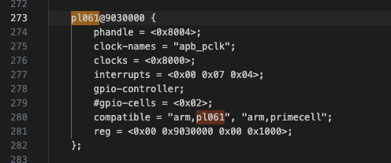

# 1.1 GPIO驱动开发

## 1. 硬件工作原理

### 1.1 模块概述

- **功能描述**

*GPIO* 是 *General Purpose Input Output（通用输入/输出）* 的缩写，也就意味着这种类型的外设可以配置为多种输入/输出类型。单根GPIO的模型可以简单理解为一根导线。
导线的一端留给硬件工程师，他们可以将这一端任意的连接到他们想要的地方，然后告诉驱动工程师，他们想要 ”这根线“ 起到什么作用；导线的一端连接到cpu核心，驱动工程师通过cpu配置这个模块为指定的功能。

[一般来说](https://zh.wikipedia.org/zh-hk/GPIO)，GPIO可以用于获取某个的高低电平，作为cpu中断触发源等等。

- **应用场景**
  - 外部中断源输出。连接到特定的开关上去，当这个开关被按下时，电压发生跳变，由此执行相应逻辑。
  - 检测外部输入，用于检查系统关键位置是否满足要求。
  - 输出恒定电压，用于点亮LED等。

- **核心特性**
  - 开漏输出：可以实现电平转换，输出电平取决于上拉电阻电源；可以实现io的线与逻辑。
  - 推挽输出：通过控制两个晶体管的开关来控制电平状态，优点是驱动能力较强，输出IO口驱动电流最大可到20ma。
  - 浮空输入：浮空输入是指将输入引脚未连接到任何外部信号源或电路，使其处于未定义的状态。
  - 下拉输入：芯片输入引脚通过电阻接到电源电压。
  - 上拉输入：芯片输入引脚通过电阻借到参考0电平。

### 1.2 硬件接口介绍

### 1.3 时序图

## 2.接口表

### pl061 接口表

- **表格格式**：

| API函数 | 描述         | 参数           | 返回值         |
| --- | --- |  --- | --- |
| Pl0611::new |创建gpio实例 | base_addr: Gpio控制器的基地址|初始化的gpio控制器 |
| Pl0611::set_func |设置gpio引脚功能 | self,ch:通道号,func: Gpio功能|Result<(),IoError>,成功Ok(()), 失败：无效的通道号|
| Pl0611::int_when |设置gpio中断条件  | self, ch:通道号,cond:什么时候触发中断，必须先配置为中断模式|Result<(),IoError> 成功Ok(()), 失败：无效的通道号|
| Pl0611::set_output |设置gpio输出值 | self, ch:通道号, val:引脚值|Result<(),IoError> 成功Ok(()), 失败：无效的通道号(没有配置为输出) |
| Pl0611::get_input |设置gpio输出值 | self, ch:通道号,|Result<bool,IoError> 成功Ok(value), 失败：无效的通道号 |


### 飞腾派 GPIO1 接口表
- **表格格式**：

| API函数 | 描述   | 参数           |  返回值    |
| --- | --- |  --- | --- |
| PhytiumGpio::new | 创建gpio实例 | base_addr: Gpio控制器的基地址|初始化的gpio控制器 |
| PhytiumGpio::set_func | 设置gpio引脚功能 | self,ch:通道号,func: Gpio功能|Result<(),IoError>,成功Ok(()), 失败：无效的通道号|
| PhytiumGpio::set_output | 设置gpio输出值 | self, ch:通道号, val:引脚值|Result<(),IoError> 成功Ok(()), 失败：无效的通道号(没有配置为输出) |
| PhytiumGpio::get_input | 设置gpio输出值 | self, ch:通道号,|Result<bool,IoError> 成功Ok(value), 失败：无效的通道号 |

- **调用顺序**
  - 中断模式
    - 初始化
    - 配置中断模式
    - 配置中断条件
    - 定义自己的中断函数并注册
  - 输入/输出模式
    - 初始化
    - 配置输入/输出功能
    - 输入/输出值

- **错误处理**
IoError::InvChn 不合法的通道

## 3. 寄存器结构
### pl061模块
- **基地址**
  对于嵌入式平台，device tree是一种常用的方法。这次实现也需要通过设备树的方法获取基地址。不幸的是 qemu 没有直接提供他的设备树，但是启动的时候确实会传递一个默认的设备树。我们通过[导出qemu设备树](#导出qemu设备树)的方法来获取设备树。获得了dts之后，我们在这个dts中搜索 "pl061",可以看到这个：

  

  pl061@9030000说明基地址为 0x9030000。

- **寄存器表**

| 寄存器名称 | 偏移 |寄存器定义 |
| --- | --- |  --- |
| GPIODIR | 0x400 | 设置GPIO引脚的输入输出功能，1代表该引脚为输出模式，0代表该引脚为输入模式。 |
| GPIOIS | 0x404 | 中断的触发方式p1，0代表检测电压，1代表检测边缘|
| GPIOIBE | 0x408 | 中断的触发方式p2，0代表中断通过GPIOIEV来控制，1代表上升沿和下降沿都能触发中断|
| GPIOIEV | 0x40c | 中断的触发方式设置p3，如果中断设置为边沿触发，0代表设置为下降沿触发，1代表上升沿触发；如果中断设置为电平触发， 0代表低电平，1代表高电平|
| GPIOIE | 0x410 | 1是使能中断，0是去使能中断 |

### 飞腾派GPIO1模块
- **基地址**
  通过数据手册可以查出，GPIO1模块的基地址为0x000_2803_5000。

- **寄存器表**

| 寄存器名称 | 偏移 | 寄存器定义 |
| --- | --- | --- |
| GPIO_SWPORT_DR | 0x00| 每一bit定义了对应引脚的输出值(当配置为输出模式时)。如果该引脚被配置为输出模式，写入这个寄存器的值将会被输出。1对应高电平，0对应低电平。|
| GPIO_SWPORT_DDR | 0x04 | 每一bit定义了对应引脚的in/out属性。1代表该引脚为输出模式，0代表该引脚为输入模式。|
| GPIO_EXT_PORT | 0x08 | 每一bit定义了对应引脚的引脚值。1代表对应引脚输出为高，0代表输出为低。 |

## 4 具体实现讲解

### qemu平台关机实验
*对于一些简单的设备，qemu能够很好的进行模拟。因此，对于部分没有开发板而想尝试进行驱动开发学习的同学，我们提供了基于qemu的部分实验。*

- 在arceos代码仓库下，使用example为helloworld，先尝试运行得到以下结果。
  <details>
    <summary>运行结果</summary>
        arceos git:(main)✗ make A=examples/helloworld PLATFORM=aarch64-qemu-virt ARCH=aarch64  LOG=debug FEATURES="driver-ramdisk,irq" run ACCEL=n GRAPHIC=n

        ... # skip part build log
        axconfig-gen configs/defconfig.toml configs/platforms/aarch64-qemu-virt.toml  -w smp=1 -w arch=aarch64 -w platform=aarch64-qemu-virt -o "/Users/jp/code/arceos/.axconfig.toml" -c "/Users/jp/code/arceos/.axconfig.toml"
        Building App: helloworld, Arch: aarch64, Platform: aarch64-qemu-virt, App type: rust
        cargo -C examples/helloworld build -Z unstable-options --target aarch64-unknown-none-softfloat --target-dir /Users/jp/code/arceos/target --release  --features "axstd/log-level-debug axstd/driver-ramdisk axstd/irq"
        Finished `release` profile [optimized] target(s) in 0.08s
        rust-objcopy --binary-architecture=aarch64 examples/helloworld/helloworld_aarch64-qemu-virt.elf --strip-all -O binary examples/helloworld/helloworld_aarch64-qemu-virt.bin
        Running on qemu...
        qemu-system-aarch64 -m 128M -smp 1 -cpu cortex-a72 -machine virt -kernel examples/helloworld/helloworld_aarch64-qemu-virt.bin -nographic

            d8888                            .d88888b.   .d8888b.
            d88888                           d88P" "Y88b d88P  Y88b
            d88P888                           888     888 Y88b.
        d88P 888 888d888  .d8888b  .d88b.  888     888  "Y888b.
        d88P  888 888P"   d88P"    d8P  Y8b 888     888     "Y88b.
        d88P   888 888     888      88888888 888     888       "888
        d8888888888 888     Y88b.    Y8b.     Y88b. .d88P Y88b  d88P
        d88P     888 888      "Y8888P  "Y8888   "Y88888P"   "Y8888P"

        arch = aarch64
        platform = aarch64-qemu-virt
        target = aarch64-unknown-none-softfloat
        build_mode = release
        log_level = debug
        smp = 1

        [  0.001902 0 axruntime:130] Logging is enabled.
        [  0.002488 0 axruntime:131] Primary CPU 0 started, dtb = 0x44000000.
        [  0.002738 0 axruntime:133] Found physcial memory regions:
        [  0.002968 0 axruntime:135]   [PA:0x40200000, PA:0x40206000) .text (READ | EXECUTE | RESERVED)
        [  0.003304 0 axruntime:135]   [PA:0x40206000, PA:0x40209000) .rodata (READ | RESERVED)
        [  0.003502 0 axruntime:135]   [PA:0x40209000, PA:0x4020d000) .data .tdata .tbss .percpu (READ | WRITE | RESERVED)
        [  0.003714 0 axruntime:135]   [PA:0x4020d000, PA:0x4024d000) boot stack (READ | WRITE | RESERVED)
        [  0.003892 0 axruntime:135]   [PA:0x4024d000, PA:0x40250000) .bss (READ | WRITE | RESERVED)
        [  0.004080 0 axruntime:135]   [PA:0x40250000, PA:0x48000000) free memory (READ | WRITE | FREE)
        [  0.004290 0 axruntime:135]   [PA:0x9000000, PA:0x9001000) mmio (READ | WRITE | DEVICE | RESERVED)
        [  0.004482 0 axruntime:135]   [PA:0x9100000, PA:0x9101000) mmio (READ | WRITE | DEVICE | RESERVED)
        [  0.004662 0 axruntime:135]   [PA:0x8000000, PA:0x8020000) mmio (READ | WRITE | DEVICE | RESERVED)
        [  0.004806 0 axruntime:135]   [PA:0xa000000, PA:0xa004000) mmio (READ | WRITE | DEVICE | RESERVED)
        [  0.004948 0 axruntime:135]   [PA:0x10000000, PA:0x3eff0000) mmio (READ | WRITE | DEVICE | RESERVED)
        [  0.005098 0 axruntime:135]   [PA:0x4010000000, PA:0x4020000000) mmio (READ | WRITE | DEVICE | RESERVED)
        [  0.005284 0 axruntime:150] Initialize platform devices...
        [  0.005420 0 axhal::platform::aarch64_common::gic:51] Initialize GICv2...
        [  0.006258 0 axruntime:176] Initialize interrupt handlers...
        [  0.006466 0 axhal::irq:32] irq=30 enabled
        [  0.006830 0 axruntime:188] Primary CPU 0 init OK.
        Hello, world!
        [  0.007086 0 axruntime:201] main task exited: exit_code=0
        [  0.007248 0 axhal::platform::aarch64_common::psci:98] Shutting down...
  </details>
- 由于目前arceos是unikernel模式，特权级为el1，所以可以直接在 *main.c* 中操作设备地址（**需要注意的是，这不是一种正确的做法。但对于初学者，为了不在一开始就去研究arecos的复杂代码框架，可以短暂的把实现代码写在这儿。**），将pl061模块的三号引脚配置为irq模式。
    ```rust
    // examples/helloworld/main.c
    ...
    /// 0x9030000 是 qemu模拟的aarch64-qemu-virt机器的 pl061模块的基地址(物理地址)。
    # /// irq number 39 从 aarch64-qemu-virt机器的设备树中找到，7 + 外部中断base(32) = 39
    unsafe fn set_gpio_irq_enable() {
        // PHYS_VIRT_OFFSET 是 arceos 初始化时，将物理内存映射时进行的偏移。
        let base_addr = (0x9030000 + PHYS_VIRT_OFFSET) as *mut u8;
        // pl061的3号引脚
        let pin = 3;
        // 将interrupt设置为边缘触发
        let gpio_is = base_addr.add(0x404);
        *gpio_is = *gpio_is & !(1 << pin);
        // 设置触发事件
        let gpio_iev = base_addr.add(0x40c);
        *gpio_iev = *gpio_iev & !(1 << pin);
        
        // 设置中断使能
        let gpio_ie = base_addr.add(0x410);
        *gpio_ie = 0;
        *gpio_ie = *gpio_ie | (1 << pin);

        # fn shut_down() {
        #    println!("shutdown function called");
        #    unsafe {
        #        let base_addr = (0x9030000 + PHYS_VIRT_OFFSET) as *mut u8;
        #        let pin = 3;
        #        // clear interrupt
        #        let gpio_ic = base_addr.add(0x41c);
        #        *gpio_ic = (1 << pin);
        #        // 关机命令
        #        core::arch::asm!(
        #            "mov w0, #0x18;
        #            hlt #0xf000"
        #        )
        #    }
        # };
        # register_handler(39, shut_down);
        # println!("set irq done");
    }
    ```
  
- 并将中断号注册到 [*GIC(generic interrupt controller)*](https://developer.arm.com/Architectures/Generic%20Interrupt%20Controller)中，中断号是39。
    ```rust
    // examples/helloworld/main.c
    ...
    # /// 0x9030000 是 qemu模拟的aarch64-qemu-virt机器的 pl061模块的基地址(物理地址)。
    /// irq number 39 从 aarch64-qemu-virt机器的设备树中找到，7 + 外部中断base(32) = 39
    # unsafe fn set_gpio_irq_enable() {
    #    // PHYS_VIRT_OFFSET 是 arceos 初始化时，将物理内存映射时进行的偏移。
    # let base_addr = (0x9030000 + PHYS_VIRT_OFFSET) as *mut u8;
    # // pl061的3号引脚
    # let pin = 3;
    # // 将interrupt设置为边缘触发
    # let gpio_is = base_addr.add(0x404);
    # *gpio_is = *gpio_is & !(1 << pin);
    # // 设置触发事件
    # let gpio_iev = base_addr.add(0x40c);
    # *gpio_iev = *gpio_iev & !(1 << pin);
    # 
    # // 设置中断使能
    # let gpio_ie = base_addr.add(0x410);
    # *gpio_ie = 0;
    # *gpio_ie = *gpio_ie | (1 << pin);

        fn shut_down() {
            println!("shutdown function called");
            unsafe {
                let base_addr = (0x9030000 + PHYS_VIRT_OFFSET) as *mut u8;
                let pin = 3;
                // clear interrupt
                let gpio_ic = base_addr.add(0x41c);
                *gpio_ic = (1 << pin);
                // 关机命令，可以用别的函数替代
                core::arch::asm!(
                    "mov w0, #0x18;
                    hlt #0xf000"
                )
            }
        };
        // register handler 会同时将注册和在gic中使能中断完成。
        register_handler(39, shut_down);
        println!("set irq done");
    # }
    ```
- 在main中死循环，等待gpio触发中断。
  ```rust
  # #[cfg_attr(feature = "axstd", unsafe(no_mangle))]
  # fn main() {
    println!("Hello, world!");
    unsafe {
        set_gpio_irq_enable();
    }
    println!("loop started!");
    loop {
        sleep(time::Duration::from_millis(10));
    }
  # }
  ```
- 重新执行第一步命令，若无报错，输入 `ctrl + a + c` 进入qemu的console模式，输入`system_powerdown`时，qemu会模拟一次中断。
  ```shell
  ...
    [  0.005842 0 axhal::platform::aarch64_common::gic:51] Initialize GICv2...
    [  0.006358 0 axruntime:176] Initialize interrupt handlers...
    [  0.006554 0 axhal::irq:32] irq=30 enabled
    [  0.007232 0 axruntime:188] Primary CPU 0 init OK.
    Hello, world!
    GPIORIS=0x0
    [  0.007688 0 axhal::irq:32] irq=39 enabled
    set irq done
    loop started!
    QEMU 9.2.0 monitor - type 'help' for more information
    (qemu) syst
    system_powerdown  system_reset      system_wakeup     
    (qemu) system_powerdown 
  ```
- *GIC* 会将中断分发给 arm 某个核心（由于我们是单核，不存在分发）, cpu对我们注册的关机函数进行回调。
  ```shell
    ...
    (qemu) system_powerdown 
    (qemu) shutdown function called
    [ 50.194414 0 axruntime::lang_items:5] panicked at /Users/jp/.cargo/registry/src/mirrors.ustc.edu.cn-38d0e5eb5da2abae/axcpu-0.1.0/src/aarch64/trap.rs:112:13:
    Unhandled synchronous exception @ 0xffff0000402010b0: ESR=0x2000000 (EC 0b000000, ISS 0x0)
    [ 50.195002 0 axhal::platform::aarch64_common::psci:98] Shutting down...
  ```

### 飞腾派点灯实验

基本思想是将GPIO配置为作为输出模式，对应的，这个GPIO可以输出为高电平或者低电平。我们都学过初中物理，知道当一个led灯两侧有足够的电压和电流的时候，它就会亮。不过一般的GPIO线输出电流能力都不强，不足以驱动一个led灯。所以一般会用以下两种方式来实现：
- led正极接电源，负极接gpio。gpio输出为低时，led点亮。
- led接 *[mos](https://baike.baidu.com/item/%E9%87%91%E5%B1%9E%E6%B0%A7%E5%8C%96%E7%89%A9%E5%8D%8A%E5%AF%BC%E4%BD%93%E5%9C%BA%E6%95%88%E5%BA%94%E7%AE%A1/8129105)* 管的*gate*。一般来说，GPIO为高电压时，会使得*mos*管闭合，led点亮；反之则熄灭。

参照飞腾派的硬件原理图，板子上有一个灯可以被我们控制，也就是*led20*，控制方法为第二种方法，控制GPIO线为GPIO1_8。


*当然，如果你愿意，飞腾派开发板提供了很多GPIO的拓展线。你可以自己实现一套电路来点亮外接的led灯。*

我们最终要实现led灯的"心跳"效果，即 亮1秒，暗1秒，如此往复循环。

- 编写驱动代码，实现 *set_dir* 和 *set_data* 操作，示例代码如下：
  ```rust
  use bitflags::bitflags;
  use safe_mmio::fields::ReadWrite;
  use zerocopy::{FromBytes, Immutable, IntoBytes, KnownLayout};

  #[derive(Clone, Eq, FromBytes, Immutable, IntoBytes, KnownLayout, PartialEq)]
  #[repr(C, align(4))]
  pub struct PhitiumGpio {
    data: ReadWrite<GpioPins>,
    resv: ReadWrite<u16>,
    dir: ReadWrite<GpioPins>,
    resv2: ReadWrite<u16>,
  }

  #[repr(transparent)]
  #[derive(Copy, Clone, Debug, Eq, FromBytes, Immutable, IntoBytes, KnownLayout, PartialEq)]
  pub struct GpioPins(u16);

  bitflags! {
    impl GpioPins: u16 {
        const p0 = 1<<0;
        const p1 = 1<<1;
        const p2 = 1<<2;
        const p3 = 1<<3;
        const p4 = 1<<4;
        const p5 = 1<<5;
        const p6 = 1<<6;
        const p7 = 1<<7;
        const p8 = 1<<8;
        const p9 = 1<<9;
        const p10 = 1<<10;
        const p11 = 1<<11;
        const p12 = 1<<12;
        const p13 = 1<<13;
        const p14 = 1<<14;
        const p15 = 1<<15;
    }
  }

  impl PhitiumGpio {
    pub fn new(base: usize) -> &'static mut Self {
        let b = base as *mut PhitiumGpio;
        unsafe { &mut (*b) }
    }
    pub fn set_pin_dir(&mut self, pin: GpioPins, dir: bool) {
        let mut status = self.dir.0.bits();
        debug!("dir data = {status}");
        let pb = pin.bits();
        if dir == true {
            status |= pb;
        } else {
            status &= !pb;
        }
        debug!("dir data = {status}");
        self.dir.0 = (GpioPins::from_bits_truncate(status));
    }
    pub fn set_pin_data(&mut self, pin: GpioPins, data: bool) {
        let mut status = self.dir.0.bits();
        debug!(" data = {status}");
        let pb = pin.bits();
        if data == true {
            status |= pb;
        } else {
            status &= !pb;
        }
        debug!(" data = {status}");
        self.data.0 = (GpioPins::from_bits_truncate(status));
    }
  }
  pub use crate::mem::phys_to_virt;
  pub use memory_addr::PhysAddr;

  pub const BASE1: PhysAddr = pa!(0x28035000);
  ```
- 由于我们目前暂时没有文件系统，无法通过读写文件的方式来控制GPIO。这里直接在main.rs中实例一个GPIO控制器进行相关初始化。
  ```rust
  // examples/helloworld/src/main.rs

  #![cfg_attr(feature = "axstd", no_std)]
  #![cfg_attr(feature = "axstd", no_main)]

  # use core::time;

  #[cfg(feature = "axstd")]
  use axstd::println;

  # use axstd::thread::sleep;

  #[cfg_attr(feature = "axstd", unsafe(no_mangle))]
  fn main() {
      println!("Hello, world!");
      let gpio0 = axhal::platform::gpio::PhitiumGpio::new(
          axhal::platform::gpio::phys_to_virt(axhal::platform::gpio::BASE1).into(),
      );
      let p = axhal::platform::gpio::GpioPins::p8;
      gpio0.set_pin_dir(p, true);
      # let mut data = false;
      # loop {
      #    sleep(time::Duration::from_secs(1));
      #    gpio0.set_pin_data(p, data);
      #    println!("current data: {data}");
      #    data = !data;
      # }
  }

  ```
- 创建一个大loop，在这个loop中，我们不停的将pin 8的值进行反转，反转一次，sleep 1s，这样就实现了1s灭，1s亮的效果。
```rust
  // examples/helloworld/src/main.rs

  # #![cfg_attr(feature = "axstd", no_std)]
  # #![cfg_attr(feature = "axstd", no_main)]

  use core::time;

  #[cfg(feature = "axstd")]
  use axstd::println;

  use axstd::thread::sleep;

  # #[cfg_attr(feature = "axstd", unsafe(no_mangle))]
  # fn main() {
      # println!("Hello, world!");
      # let gpio0 = axhal::platform::gpio::PhitiumGpio::new(
      #    axhal::platform::gpio::phys_to_virt(axhal::platform::gpio::BASE1).into(),
      # );
      # let p = axhal::platform::gpio::GpioPins::p8;
      # gpio0.set_pin_dir(p, true);
      # et mut data = false;
      loop {
          sleep(time::Duration::from_secs(1));
          gpio0.set_pin_data(p, data);
          println!("current data: {data}");
          data = !data;
      }
#  } 
```

- 通过`make A=examples/helloworld ARCH=aarch64 PLATFORM=aarch64-phytium-pi  FEATURES=irq LOG=debug`进行编译，并烧入飞腾派运行。下面是运行日志以及实拍。
<details>
  <summary>运行结果</summary>

    Starting kernel ...


          d8888                            .d88888b.   .d8888b.
          d88888                           d88P" "Y88b d88P  Y88b
        d88P888                           888     888 Y88b.
        d88P 888 888d888  .d8888b  .d88b.  888     888  "Y888b.
      d88P  888 888P"   d88P"    d8P  Y8b 888     888     "Y88b.
      d88P   888 888     888      88888888 888     888       "888
    d8888888888 888     Y88b.    Y8b.     Y88b. .d88P Y88b  d88P
    d88P     888 888      "Y8888P  "Y8888   "Y88888P"   "Y8888P"

    arch = aarch64
    platform = aarch64-phytium-pi
    target = aarch64-unknown-none-softfloat
    build_mode = release
    log_level = trace
    smp = 1

    [ 13.461312 0 axruntime:130] Logging is enabled.
    [ 13.467040 0 axruntime:131] Primary CPU 0 started, dtb = 0xf9c29000.
    [ 13.474591 0 axruntime:133] Found physcial memory regions:
    [ 13.481276 0 axruntime:135]   [PA:0x90000000, PA:0x90007000) .text (READ | EXECUTE | RESERVED)
    [ 13.491083 0 axruntime:135]   [PA:0x90007000, PA:0x9000a000) .rodata (READ | RESERVED)
    [ 13.500197 0 axruntime:135]   [PA:0x9000a000, PA:0x9000e000) .data .tdata .tbss .percpu (READ | WRITE | RESERVED)
    [ 13.511655 0 axruntime:135]   [PA:0x9000e000, PA:0x9004e000) boot stack (READ | WRITE | RESERVED)
    [ 13.521724 0 axruntime:135]   [PA:0x9004e000, PA:0x90051000) .bss (READ | WRITE | RESERVED)
    [ 13.531272 0 axruntime:135]   [PA:0x90051000, PA:0x100000000) free memory (READ | WRITE | FREE)
    [ 13.541167 0 axruntime:135]   [PA:0x2800c000, PA:0x2800d000) mmio (READ | WRITE | DEVICE | RESERVED)
    [ 13.551496 0 axruntime:135]   [PA:0x2800d000, PA:0x2800e000) mmio (READ | WRITE | DEVICE | RESERVED)
    [ 13.561825 0 axruntime:135]   [PA:0x2800e000, PA:0x2800f000) mmio (READ | WRITE | DEVICE | RESERVED)
    [ 13.572155 0 axruntime:135]   [PA:0x2800f000, PA:0x28010000) mmio (READ | WRITE | DEVICE | RESERVED)
    [ 13.582484 0 axruntime:135]   [PA:0x30000000, PA:0x38000000) mmio (READ | WRITE | DEVICE | RESERVED)
    [ 13.592813 0 axruntime:135]   [PA:0x40000000, PA:0x50000000) mmio (READ | WRITE | DEVICE | RESERVED)
    [ 13.603142 0 axruntime:135]   [PA:0x58000000, PA:0x80000000) mmio (READ | WRITE | DEVICE | RESERVED)
    [ 13.613471 0 axruntime:135]   [PA:0x28014000, PA:0x28016000) mmio (READ | WRITE | DEVICE | RESERVED)
    [ 13.623800 0 axruntime:135]   [PA:0x28016000, PA:0x28018000) mmio (READ | WRITE | DEVICE | RESERVED)
    [ 13.634130 0 axruntime:135]   [PA:0x28018000, PA:0x2801a000) mmio (READ | WRITE | DEVICE | RESERVED)
    [ 13.644459 0 axruntime:135]   [PA:0x2801a000, PA:0x2801c000) mmio (READ | WRITE | DEVICE | RESERVED)
    [ 13.654788 0 axruntime:135]   [PA:0x2801c000, PA:0x2801e000) mmio (READ | WRITE | DEVICE | RESERVED)
    [ 13.665117 0 axruntime:135]   [PA:0x28034000, PA:0x28035000) mmio (READ | WRITE | DEVICE | RESERVED)
    [ 13.675446 0 axruntime:135]   [PA:0x28035000, PA:0x28036000) mmio (READ | WRITE | DEVICE | RESERVED)
    [ 13.685776 0 axruntime:135]   [PA:0x28036000, PA:0x28037000) mmio (READ | WRITE | DEVICE | RESERVED)
    [ 13.696105 0 axruntime:135]   [PA:0x28037000, PA:0x28038000) mmio (READ | WRITE | DEVICE | RESERVED)
    [ 13.706434 0 axruntime:135]   [PA:0x28038000, PA:0x28039000) mmio (READ | WRITE | DEVICE | RESERVED)
    [ 13.716763 0 axruntime:135]   [PA:0x28039000, PA:0x2803a000) mmio (READ | WRITE | DEVICE | RESERVED)
    [ 13.727093 0 axruntime:150] Initialize platform devices...
    [ 13.733776 0 axhal::platform::aarch64_common::gic:51] Initialize GICv2...
    [ 13.741897 0 axhal::platform::aarch64_common::gic:27] GICD set enable: 30 true
    [ 13.750182 0 axhal::platform::aarch64_common::gic:27] GICD set enable: 116 true
    [ 13.758688 0 axruntime:176] Initialize interrupt handlers...
    [ 13.765545 0 axhal::platform::aarch64_common::gic:36] register handler irq 30
    [ 13.773878 0 axhal::platform::aarch64_common::gic:27] GICD set enable: 30 true
    [ 13.782298 0 axruntime:188] Primary CPU 0 init OK.
    Hello, world!
    [ 13.789589 0 axhal::platform::aarch64_phytium_pi::gpio:46] dir data = 0
    [ 13.797401 0 axhal::platform::aarch64_phytium_pi::gpio:53] dir data = 256
    [ 14.805386 0 axhal::platform::aarch64_phytium_pi::gpio:58]  data = 256
    [ 14.810239 0 axhal::platform::aarch64_phytium_pi::gpio:65]  data = 0
    current data: false
    [ 15.819614 0 axhal::platform::aarch64_phytium_pi::gpio:58]  data = 256
    [ 15.824467 0 axhal::platform::aarch64_phytium_pi::gpio:65]  data = 256
    current data: true
    [ 16.833928 0 axhal::platform::aarch64_phytium_pi::gpio:58]  data = 256
    [ 16.838781 0 axhal::platform::aarch64_phytium_pi::gpio:65]  data = 0
    current data: false
    [ 17.848156 0 axhal::platform::aarch64_phytium_pi::gpio:58]  data = 256
    [ 17.853009 0 axhal::platform::aarch64_phytium_pi::gpio:65]  data = 256
    current data: true
    [ 18.862470 0 axhal::platform::aarch64_phytium_pi::gpio:58]  data = 256
    [ 18.867323 0 axhal::platform::aarch64_phytium_pi::gpio:65]  data = 0
    current data: false
    [ 19.876698 0 axhal::platform::aarch64_phytium_pi::gpio:58]  data = 256
    [ 19.881551 0 axhal::platform::aarch64_phytium_pi::gpio:65]  data = 256
    current data: true
    [ 20.891012 0 axhal::platform::aarch64_phytium_pi::gpio:58]  data = 256
    [ 20.895865 0 axhal::platform::aarch64_phytium_pi::gpio:65]  data = 0
    current data: false
    [ 21.905240 0 axhal::platform::aarch64_phytium_pi::gpio:58]  data = 256
    [ 21.910093 0 axhal::platform::aarch64_phytium_pi::gpio:65]  data = 256
    current data: true
    [ 22.919554 0 axhal::platform::aarch64_phytium_pi::gpio:58]  data = 256
    [ 22.924407 0 axhal::platform::aarch64_phytium_pi::gpio:65]  data = 0
    current data: false
    [ 23.933782 0 axhal::platform::aarch64_phytium_pi::gpio:58]  data = 256
    [ 23.938635 0 axhal::platform::aarch64_phytium_pi::gpio:65]  data = 256
    current data: true
    [ 24.948097 0 axhal::platform::aarch64_phytium_pi::gpio:58]  data = 256
    [ 24.952950 0 axhal::platform::aarch64_phytium_pi::gpio:65]  data = 0
    current data: false
</details>

  

  

## 5. 开发注意

### 5.1 优化代码

- 目前驱动代码位于 `examples/helloworld/main.c` 中，这不是一种正确的做法。参考 `modules/axhal/src/platform/aarch64_common/pl011.rs` 的实现，在同级目录下实现 pl061.rs。 rust 提供了如 `tock_registers` 这样的可以用来定义寄存器的crate，用起来！
- 关机函数实际上是触发了一个异常而导致的关机，当把上一步完成后，换成 `axhal::misc::terminate` 来优雅的关机！
- 实验2的完整代码在<https://github.com/arceos-org/arceos/commit/2e7837a786d13b0a77804d15a10f614ef715150d>。

## 6. 参考资料

### pl061_datasheet:
<https://github.com/elliott10/dev-hw-driver/blob/main/docs/GPIO-controller-pl061-DDI0190.pdf>
### 导出qemu设备树:
<https://blog.51cto.com/u_15072780/3818667>
### 飞腾派硬件原理图:
<https://github.com/elliott10/dev-hw-driver/blob/main/phytiumpi/docs/%E9%A3%9E%E8%85%BE%E6%B4%BEv3%E5%8E%9F%E7%90%86%E5%9B%BE%20cek8903_piq_v3_sch20240506.pdf>
### 飞腾派软件开发手册
 <https://github.com/elliott10/dev-hw-driver/blob/main/phytiumpi/docs/飞腾派软件编程手册V1.0.pdf>
