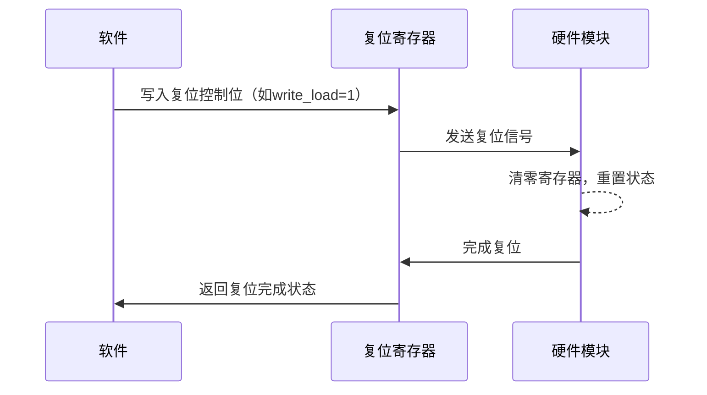
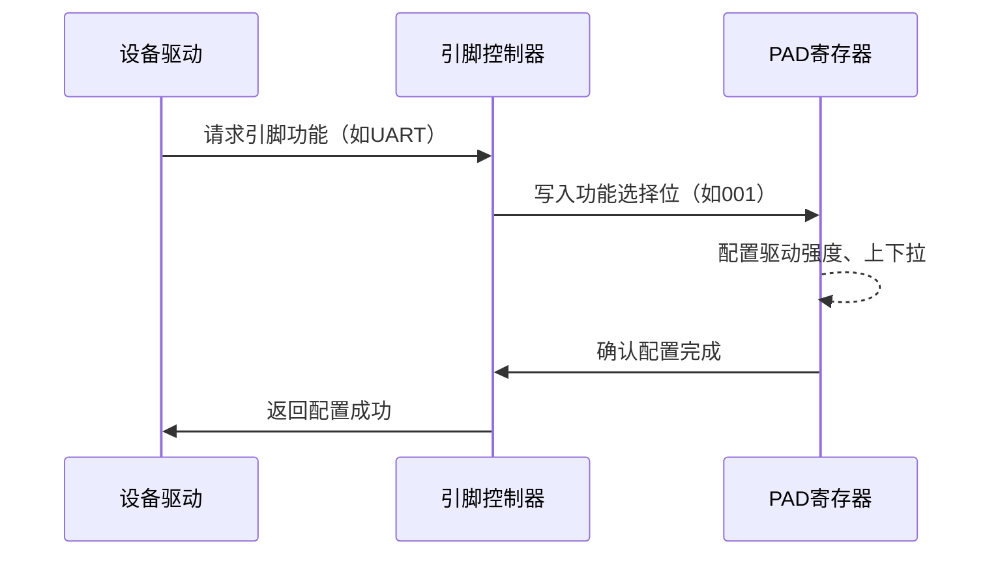
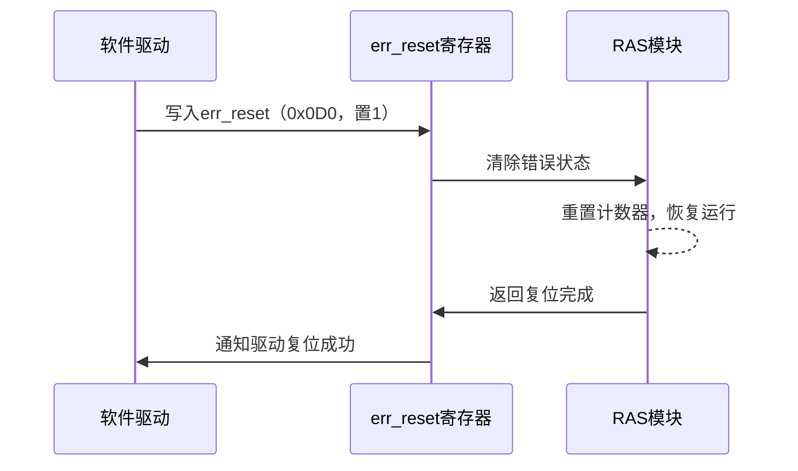
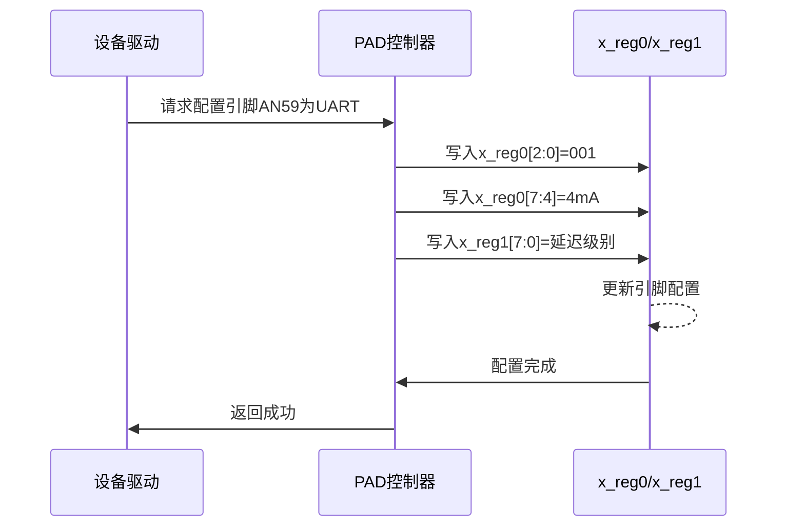

# 1.3 复位与引脚复用驱动

## 硬件原理

**复位**

复位是嵌入式系统中将硬件模块或整个系统恢复到已知初始状态的过程，用于初始化硬件、清除错误状态或恢复系统运行。复位机制通常包括以下类型：

- **上电复位（Power-on Reset, POR）**：系统上电时由硬件自动触发，初始化所有寄存器和模块到默认状态。
- **软件复位（Software Reset）**：通过软件写入特定控制寄存器触发，针对系统或特定模块。
- **看门狗复位（Watchdog Reset）**：由看门狗定时器在检测到系统超时或故障时触发，重启系统。
- **外部复位**：通过外部引脚输入信号（如低电平脉冲）触发，通常用于调试或手动重置。

复位过程通常涉及以下步骤：

1. **触发信号**：硬件或软件生成复位信号（如寄存器写入或外部引脚电平变化）。
2. **寄存器清零**：相关寄存器（如计数器、状态寄存器）被设置为默认值（通常为0x0）。
3. **模块初始化**：硬件模块（如CPU、定时器、外设）恢复到初始状态，准备重新运行。

**复位类型比较**

| 复位类型   | 触发方式         | 作用范围       | 典型应用场景   |
| ---------- | ---------------- | -------------- | -------------- |
| 上电复位   | 硬件上电自动触发 | 整个系统       | 系统启动初始化 |
| 软件复位   | 写入控制寄存器   | 系统或特定模块 | 模块错误恢复   |
| 看门狗复位 | 定时器超时       | 整个系统       | 系统故障恢复   |
| 外部复位   | 外部引脚信号     | 整个系统或模块 | 调试或手动重置 |

**引脚复用**

引脚复用（Pin Multiplexing）是嵌入式系统中优化引脚资源的技术，允许一个物理引脚支持多种功能（如GPIO、UART、SPI、I2C等）。由于SoC引脚数量有限，引脚复用通过配置寄存器动态选择引脚的功能和电气特性（如驱动强度、上下拉电阻、延迟）。

引脚复用机制的工作原理：

- **功能选择**：通过控制寄存器（如功能选择寄存器）的位字段选择引脚功能。例如，3位字段可支持8种功能（如000=GPIO，001=UART）。
- **电气特性配置**：调整驱动强度（mA）、上下拉电阻（上拉/下拉/无）以及输入/输出延迟，以适配不同外设的信号要求。
- **设备树映射**：在嵌入式系统中，引脚复用通常通过设备树（Device Tree）定义，映射到具体寄存器配置。

**引脚复用功能示例**

| 功能选择位 | 功能 | 描述         |
| ---------- | ---- | ------------ |
| 000        | GPIO | 通用输入输出 |
| 001        | UART | 串口通信     |
| 010        | SPI  | 串行外设接口 |
| 011        | I2C  | 两线串行总线 |

## 飞腾派复位与引脚复用系统

飞腾派开发板基于飞腾E2000处理器（ARMv8架构，2个FTC664核@1.8GHz和2个FTC310核@1.5GHz），其复位和引脚复用系统由Timer、RAS和PAD模块支持。以下详细介绍飞腾派的实现。

### 飞腾派复位系统

飞腾派的复位系统由Timer和RAS模块实现，支持系统级和模块级复位。

#### Timer模块

Timer模块用于定时功能，同时支持复位操作。其关键特性包括：

- **全局恢复位**：通过控制寄存器（如ctrl_reg）的write_load位，重置计数器到默认值（通常0x0）。
- **重启/自由运行模式**：复位后可选择重新计数或进入自由运行状态。
- **应用场景**：初始化Timer模块或触发系统软复位。

**Timer模块复位功能**

| 功能       | 描述                    | 触发方式                   |
| ---------- | ----------------------- | -------------------------- |
| 计数器复位 | 将计数器寄存器清零      | 写入ctrl_reg的write_load位 |
| 模块初始化 | 重置Timer模块到初始状态 | 软件控制或上电复位         |

#### RAS模块

RAS（可靠性、可用性和可服务性）模块通过错误重置寄存器管理错误状态恢复，增强系统可靠性。其关键特性包括：

- **错误重置**：通过err_reset寄存器（偏移0x0D0，32位）清除错误状态或计数器。
- **安全属性配置**：通过err_reset_set寄存器（偏移0x0B0，64位）设置安全状态（1为安全，0为非安全）。
- **错误注入**：通过err_inject_num寄存器模拟错误状态，用于调试。

**RAS模块复位功能**

| 功能         | 描述                 | 触发方式           |
| ------------ | -------------------- | ------------------ |
| 错误状态清除 | 清除错误计数器或状态 | 写入err_reset      |
| 安全属性配置 | 设置复位操作的安全性 | 写入err_reset_set  |
| 错误注入     | 模拟错误触发复位     | 写入err_inject_num |

#### 看门狗支持

飞腾派支持看门狗定时器，通过 watchdog_ctrl 寄存器配置超时时间，触发系统级复位，适用于故障恢复场景。

### 飞腾派引脚复用系统

飞腾派的引脚复用由PAD模块管理，支持10个复用引脚，每个引脚通过两个寄存器（x_reg0和x_reg1）配置，基地址推测为0x32830000。每个引脚可动态切换功能（如GPIO、UART、SPI、I2C）和电气特性。

#### PAD模块功能

- **功能选择**：x_reg0的位[2:0]选择引脚功能（如000=GPIO，001=UART）。
- **驱动强度**：x_reg0的位[7:4]设置驱动电流（默认4mA）。
- **上下拉电阻**：x_reg0的位[9:8]配置上拉、下拉或无电阻。
- **输入/输出延迟**：x_reg1配置输入延迟（位[7:0]，粒度100ps）和输出延迟（位[15:8]，粒度366ps，最大3.7ns）。

**飞腾派引脚复用配置**

| 配置项     | 寄存器 | 位字段 | 功能描述                       |
| ---------- | ------ | ------ | ------------------------------ |
| 功能选择   | x_reg0 | [2:0]  | 选择引脚功能（如GPIO、UART）   |
| 驱动强度   | x_reg0 | [7:4]  | 设置驱动电流（默认4mA）        |
| 上下拉电阻 | x_reg0 | [9:8]  | 配置上拉/下拉/无电阻           |
| 输入延迟   | x_reg1 | [7:0]  | 启用延迟，粒度100ps            |
| 输出延迟   | x_reg1 | [15:8] | 启用延迟，粒度366ps，最大3.7ns |

**飞腾派引脚复用配置**

#### 引脚复用示例

飞腾派40Pin接口支持多种功能（如GPIO、UART、I2C），通过设备树定义引脚组。例如，引脚AN59可配置为：

- **GPIO**：x_reg0[2:0]=000，用于通用输入输出。
- **UART**：x_reg0[2:0]=001，用于串口通信。
- **I2C**：x_reg0[2:0]=011，用于两线总线。

配置时需确保功能有效，并根据外设需求调整电气特性。

## 驱动 API 调用表

TODO

## 寄存器基地址表

TODO

## 驱动实现解析

TODO

