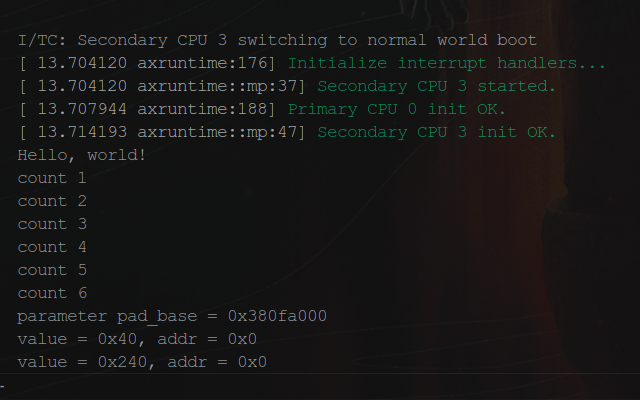

# 2.3 看门狗驱动
看门狗是为了保障系统在因为某些错误导致挂起时，用来恢复系统所设计的一个硬件．其内部有个定时器，如果在定时器超时时间内，没有周期性地去"喂"（通常以设置某个寄存器，或者拉升/低某个引脚的形式）看门狗，则会导致看门狗重启整个系统．所以，从用户使用的角度来看，用户通常是会设计一个周期性"喂"看门狗的程序，如果内核崩溃恐慌导致系统挂起，则该程序无法继续"喂"狗，看门狗超时导致系统重启．


如上所述，一个看门狗驱动，至少需要提供让用户可以设置超时，启动/关闭看门狗，"喂＂狗等等的接口．因此，在飞腾派Linux内核源码的`include/linux/watchdog.h`文件中，我们可以看到这样的定义
```c
/** struct watchdog_ops - The watchdog-devices operations
 *
 * @owner:	The module owner.
 * @start:	The routine for starting the watchdog device.
 * @stop:	The routine for stopping the watchdog device.
 * @ping:	The routine that sends a keepalive ping to the watchdog device.
 * @status:	The routine that shows the status of the watchdog device.
 * @set_timeout:The routine for setting the watchdog devices timeout value (in seconds).
 * @set_pretimeout:The routine for setting the watchdog devices pretimeout.
 * @get_timeleft:The routine that gets the time left before a reset (in seconds).
 * @restart:	The routine for restarting the machine.
 * @ioctl:	The routines that handles extra ioctl calls.
 *
 * The watchdog_ops structure contains a list of low-level operations
 * that control a watchdog device. It also contains the module that owns
 * these operations. The start function is mandatory, all other
 * functions are optional.
 */
struct watchdog_ops {
	struct module *owner;
	/* mandatory operations */
	int (*start)(struct watchdog_device *);
	/* optional operations */
	int (*stop)(struct watchdog_device *);
	int (*ping)(struct watchdog_device *);
	unsigned int (*status)(struct watchdog_device *);
	int (*set_timeout)(struct watchdog_device *, unsigned int);
	int (*set_pretimeout)(struct watchdog_device *, unsigned int);
	unsigned int (*get_timeleft)(struct watchdog_device *);
	int (*restart)(struct watchdog_device *, unsigned long, void *);
	long (*ioctl)(struct watchdog_device *, unsigned int, unsigned long);
};
```
上面的结构体描述了，Linux下，一个看门狗设备需要提供的操作接口．而这些，由驱动实现．本节我们只会分析其中的`start`，`set_timeout`和`ping`接口，其它接口的说明，超出了本节范围，其中`ping`方法既是用来给用户提供一个"喂"狗的接口的，而另两个，顾名思义，分别是启动看门狗和设置看门狗超时的功能的．

接下来，我们会结合飞腾派的文档和Linux内核源码，分析如何在Arceos中实现对应的接口．要说明的是，飞腾派中的看门狗的设计遵照ARM-Sbsa规范，其驱动实现位于`drivers/watchdog/sbsa-gwdt`下．我们可以看到其中对应的方法实现，分别是
```c
static const struct watchdog_ops sbsa_gwdt_ops = {
	.owner		= THIS_MODULE,
	.start		= sbsa_gwdt_start,
	.stop		= sbsa_gwdt_stop,
	.ping		= sbsa_gwdt_keepalive,
	.set_timeout	= sbsa_gwdt_set_timeout,
	.get_timeleft	= sbsa_gwdt_get_timeleft,
};
```
继续看下去，我们会发现`sbsa_gwdt_start`，`sbsa_gwdt_set_timeout`和`sbsa_gwdt_keepalive`三个函数的实现异常简单，没有太多"魔法"在里面．如下
```c
static void sbsa_gwdt_reg_write(u64 val, struct sbsa_gwdt *gwdt)
{
	if (gwdt->version == 0)
		writel((u32)val, gwdt->control_base + SBSA_GWDT_WOR);
	else
		lo_hi_writeq(val, gwdt->control_base + SBSA_GWDT_WOR);
}
/*
 * watchdog operation functions
 */
static int sbsa_gwdt_set_timeout(struct watchdog_device *wdd,
				 unsigned int timeout)
{
	struct sbsa_gwdt *gwdt = watchdog_get_drvdata(wdd);

	wdd->timeout = timeout;
	timeout = clamp_t(unsigned int, timeout, 1, wdd->max_hw_heartbeat_ms / 1000);

	if (action)
		sbsa_gwdt_reg_write((u64)gwdt->clk * timeout, gwdt);
	else
		/*
		 * In the single stage mode, The first signal (WS0) is ignored,
		 * the timeout is (WOR * 2), so the WOR should be configured
		 * to half value of timeout.
		 */
		sbsa_gwdt_reg_write(((u64)gwdt->clk / 2) * timeout, gwdt);

	return 0;
}

static int sbsa_gwdt_keepalive(struct watchdog_device *wdd)
{
	struct sbsa_gwdt *gwdt = watchdog_get_drvdata(wdd);

	/*
	 * Writing WRR for an explicit watchdog refresh.
	 * You can write anyting (like 0).
	 */
	writel(0, gwdt->refresh_base + SBSA_GWDT_WRR);

	return 0;
}

static int sbsa_gwdt_start(struct watchdog_device *wdd)
{
	struct sbsa_gwdt *gwdt = watchdog_get_drvdata(wdd);

	/* writing WCS will cause an explicit watchdog refresh */
	writel(SBSA_GWDT_WCS_EN, gwdt->control_base + SBSA_GWDT_WCS);

	return 0;
}
```
本质上，是对`SBSA_GWDT_WOR`，`SBSA_GWDT_WRR`和`SBSA_GWDT_WCS`三个寄存器的操作．关于这些寄存器的描述，我们可以在*飞腾派软件软件编程手册V1.0*上找到．
> WDT_WRR (0x0000)

|域|位|读写|复位值|描述|
|:-:|:-:|:-:|:-:|:-:|
|WDT_WRR|31:0|RW|0x0|Watchdog更新寄存器．写操作会重新开始看门狗计数，读返回0| 

> WDT_WOR (0x1008)

|域|位|读写|复位值|描述|
|:-:|:-:|:-:|:-:|:-:|
|WDT_WOR|31:0|RO|0x3000000|Watchdog清除寄存器|

> WDT_WCS (0x1000)

|域|位|读写|复位值|描述|
|:-:|:-:|:-:|:-:|:-:|
|reserved|31:3|RO|0x0|保留|
|Ws1|2|RO|0x0|二次超时，读返回当前ws1的值|
|Ws0|1|RO|0x0|一次超时，读返回当期ws0的值|
|Wdt_en|0|RW|0x0|Watchdog使能信号，高有效，常规复位和热保护都会清0．|

对该三个寄存器的写入，会直接导致sys_cnt+WOR寄存器储存的值被更新到WCV寄存器中．而sys_cnt的计数值大于当前WCV寄存器存储的比较值则会导致看门狗超时．


为了让Arceos支持对这三个寄存器进行读取写入，我们需要将三个寄存器的地址空间映射到内核虚拟空间中，在`configs/platforms/aarch64-phytium-pi.toml`文件中，修改`mmio-regions`部分，添加上对看门狗的支持.
```toml
#
# Device specifications
#
[devices]
# MMIO regions with format (`base_paddr`, `size`).
mmio-regions = [
    [0x2800_C000, 0x1000],  # UART 0
    [0x2800_D000, 0x1000],  # UART 1
    [0x2800_E000, 0x1000],  # UART 2
    [0x2800_F000, 0x1000],  # UART 3

    [0x3000_0000, 0x800_0000],  # other devices
    [0x4000_0000, 0x1000_0000], # Pcie ecam

    [0x5800_0000, 0x2800_0000], # 32-bit MMIO space

    [0x2801_4000, 0x2000],  # MIO0 - I2C
    [0x2801_6000, 0x2000],  # MIO1 - I2C
    [0x2801_8000, 0x2000],  # MIO2 - I2C
    [0x2801_A000, 0x2000],  # MIO3 - I2C
    [0x2801_C000, 0x2000],  # MIO4 - I2C

    [0x000_2803_4000, 0x1000],  # GPIO0
    [0x000_2803_5000, 0x1000],  # GPIO1
    [0x000_2803_6000, 0x1000],  # GPIO2
    [0x000_2803_7000, 0x1000],  # GPIO3
    [0x000_2803_8000, 0x1000],  # GPIO4
    [0x000_2803_9000, 0x1000],  # GPIO5
    [0x000_2804_0000, 0x2000],  # WDT0
    [0x000_2804_2000, 0x2000],  # WDT1
] 

# Watchdog Address
wdt0-paddr = 0x2804_0000         # uint
wdt1-paddr = 0x2804_2000         # uint
```
在`axhal/src/platform/aarch64_common`文件夹下创建`sbsa_wdt.rs`文件，之后我们就可以参照之前linux源码中的实现，来完成看门狗使能，设置超时和关闭看门狗的功能
```rust
/// Start Watchdog
pub fn start_watchdog() {
    axlog::debug!("starting watchdog");
    let wdt = WDT.lock();
    unsafe {
        // Enable Watchdog Timer
        core::ptr::write_volatile(
            (wdt.0 + SBSA_GWDT_WCS) as *mut u32, 0x1);
    }
}

pub fn set_watchdog_timeout(timeout: u32) {
    axlog::debug!("set watchdog timeout: {timeout}");
    let clk = CNTFRQ_EL0.get();
    let wdt = WDT.lock();
    unsafe {
        core::ptr::write_volatile(
            (wdt.0 + SBSA_GWDT_WOR) as *mut u32, (clk * timeout as u64 / 2) as u32);
    }
}

pub fn stop_watchdog() {
    axlog::debug!("stopping watchdog");
    let wdt = WDT.lock();
    unsafe {
        // Disable Watchdog Timer
        core::ptr::write_volatile(
            (wdt.0 + SBSA_GWDT_WCS) as *mut u32, 0x0);
    }
}

pub fn ping_watchdog() {
    axlog::debug!("feeding watchdog");
    let wdt = WDT.lock();
    unsafe {
        // Write to Watchdog Timer Reset Register to reset the timer
        core::ptr::write_volatile(
            (wdt.0 + SBSA_GWDT_WRR) as *mut u32, 0);
    }
}
```
接下来，我们进行测试，我们可以选择在内核中启用看门狗，并设置超时时间为6秒，
```rust
super::aarch64_common::sbsa_wdt::set_watchdog_timeout(6);
super::aarch64_common::sbsa_wdt::start_watchdog();
```
同时编写个测试应用
```rust
fn main() {
    println!("Hello, world!");
    let mut count = 1usize;
    loop {
        println!("count {count}");
        count += 1;
        axstd::thread::sleep(core::time::Duration::from_secs(1));
    }
}
```
可观察到如下现象，应用程序计时到第6秒时，设备重启了．

