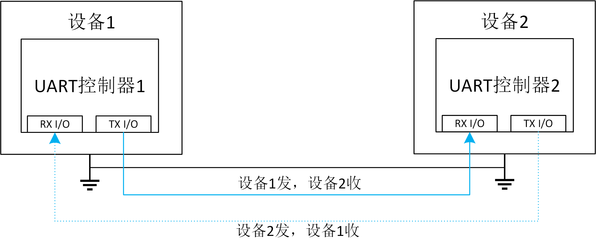

# 3.1 UART串口驱动

## *UART* 介绍
### 1.1 模块概述

*uart: universal asynchronous receiver/transmitter*，通用异步发送/接受器，是嵌入式设备中最常用全双工通信协议之一。关于它的详细介绍，可以参考 [这篇文章](https://www.analog.com/cn/resources/analog-dialogue/articles/uart-a-hardware-communication-protocol.html)。对于软件工程师来说，以下几个概念是必须要掌握的。
- 波特率
  
  波特率就是一秒传递多少bit。由于uart里面并没有时钟线，这也就意味着通信双方需要预先约定好具体的通信速率是多少。使用过类似于*xshell*这样的串口工具的同学应该就知道，在配置串口的时候，这个值配置不对就会导致屏幕上出现乱码。常用的波特率有115200，9600等。

- 数据宽度

  一次传输的数据宽度，可以是5-8的一个值，常见是8bit，因为这对软件开发者来说最友好。毕竟，你也不想把一个*u8*拆成5bits和3bits来发送吧～

- 停止位

  一个特殊的bit，用来告诉对方这一次传输结束了。可以配置为1位或者2位。
- 奇偶校验

  在数据传输时增加额外一个1bit，用来使得这一个bit+数据的每一位为1的总数为奇数或者偶数。发送端在发送时，计算出奇偶校验位应该为1或者为0，接收端在接受时，就可以根据这一位校验出数据传输是否出错。当然，这个校验非常不准确，一般不开。

- 8N1

  这是一种缩写，意味着8个数据位，没有奇偶校验，1位停止位。这是最常见的串口配置。

- 调制/解调

    一些高级的uart芯片集成了[调制/解调](https://www.cnblogs.com/jason-lu/articles/3171907.html)的功能，这涉及到了通信原理的一些知识，其配置也对应的复杂更多。飞腾派上搭载9线串口就具有这个功能，不过幸运的是本次实验不涉及这块内容，所以在看寄存器定义时，也不需要对这部分有深入理解。

### 1.2 硬件接口介绍
- **3线串口连接图**
一个典型的三线串口连接图如下：



### 1.3 时序图

*notice: 这里的时钟不会体现在传输线上，展示设备内部接受/发送时序。*

这个图展示了一帧数据的可能结构。


## 2. 接口表
完整代码在这儿: <https://github.com/chenlongos/appd/commit/897c85c5952a123fa27f8612a4a5c86d37d679e3>
- **接口表**

| API函数 | 描述         | 参数           | 返回值         |
| --- | --- |  --- | --- |
| PhytiumUart::new | 新的飞腾派uart实例 |  base:uart控制器基地址 | uart控制器 |
| PhytiumUart::init_no_irq | 创建非irq模式的uart控制器 | self, clock_hz: uart时钟频率，baude_rate: uart波特率 | none |
| PhytiumUart::read_byte_poll | 轮询的方式读取一个字节 | self | u8，一个读取的字节 |
| PhytiumUart::put_byte_poll | 轮询的方式输出一个字节 | self, byte:输出的字节 | none |

- **调用顺序**
首先进行 new -> init_no_irq, 之后可以按照需求进行读取或者写入字节。


## 3. 寄存器结构

我们主要关注下面几个寄存器，这些寄存器的定义可以在[飞腾派软件开发手册](#参考资料)里找到。
- UARTDR: 数据寄存器，用来传输/接受最大8位的数据
- UARTRSR/UARTECR: 接受状态寄存器，用来查看接收过程中是否产生了错误，写这个寄存器可以清除错误。
- UARTFR：标志寄存器，存了各种各样的标志，包括设备忙，发送队列是否为空等等。发送接收都需要查看这个寄存器。
- UARTIBRD：存储波特率经过算法转变后的整数部分
- UARTFBRD：存储波特率经过算法转变后的小数部分
- UARTLCR_H：线控寄存器，控制uart的一些行为。
- UARTLCR：控制寄存器，控制uart的一些行为。
- UARTIMSC：控制是否打开中断。
  
| 寄存器名称 | 偏移 |寄存器定义 |
| --- | --- |  --- |  
| UARTDR |  0x000 | 数据寄存器 |
| UARTRSR/UARTECR | 0x004 | 接收状态寄存器/错误清除寄存器 |
| UARTFR |  0x018 | 标志寄存器 |
| UARTILPR | 0x020 |  低功耗计数寄存器 |
| UARTIBRD | 0x024 | 波特率整数值配置寄存器 |
| UARTFBRD |  0x028 | 波特率小数值配置寄存器 |
| UARTLCR_H |  0x02C | 线控寄存器 |
| UARTCR |  0x030 | 控制寄存器 |
| UARTIFLS | 0x034 | FIFO 阈值选择寄存器 |
| UARTIMSC |  0x038  | 中断屏蔽选择/清除寄存器 |
| UARTRIS | 0x03C | 中断状态寄存器 |
| UARTMIS | 0x040 | 中断屏蔽状态寄存器 |
| UARTICR | 0x044 | 中断清除寄存器 |
| UARTDMACR | 0x048 | DMA 控制寄存器 |

### uart初始化步骤
参考 [飞腾派软件开发手册](#参考资料) 的 5.22.1.1章节。

### 发送数据操作流程
参考 [飞腾派软件开发手册](#参考资料) 的 5.22.1.2章节。

### 接收数据操作流程
参考 [飞腾派软件开发手册](#参考资料) 的 5.22.1.3章节。


## 4. 飞腾派 *UART* 串口驱动实验

### 4.1 实验目标
- 编写代码实现串口驱动
  - 初始化为8N1模式，波特率为115200，非中断模式
  - 没有tx/rx FIFO队列，单次接收/发送1一个byte。
- 验证串口通信的基本原理

### 4.2 实验原理
根据原理图，我们使用飞腾派的*UART2*串口，它被连线到*J1*端子板的8(tx),10(rx)口上。用[杜邦线](https://baike.baidu.com/item/%E6%9D%9C%E9%82%A6%E7%BA%BF/197049)将8口与10口相连接，uart2 tx发出的数据会被uart rx口被收到。


### 4.3 实验步骤
- 根据数据手册，先使用tock-register库将寄存器定义好，将初始化函数实现。使用者通过传入一个 基地址 指向uart寄存器，返回一个不可并发的uart。
```rust
// modules/axhal/src/platform/aarch64_phytium_pi/uart.rs

use core::ptr::NonNull;

use tock_registers::{
    interfaces::{Readable, Writeable},
    register_bitfields, register_structs,
    registers::{ReadOnly, ReadWrite, WriteOnly},
};

register_structs! {
    PhytiumUartRegs {
        /// Data Register.
        (0x00 => dr: ReadWrite<u32, DATA::Register>),
        (0x04 => _reserved0),
        /// Flag Register.
        (0x18 => fr: ReadOnly<u32, FLAG::Register>),
        (0x1c => _reserved1),
        ///
        (0x24 => tibd: ReadWrite<u32>),
        ///
        (0x28 => tfbd: ReadWrite<u32>),
        /// Control register.
        (0x2c => cr_h: ReadWrite<u32, CONTROLH::Register>),
        (0x30 => cr_l: ReadWrite<u32,CONTROLL::Register>),
        /// Interrupt FIFO Level Select Register.
        (0x34 => ifls: ReadWrite<u32>),
        /// Interrupt Mask Set Clear Register.
        (0x38 => imsc: ReadWrite<u32>),
        /// Raw Interrupt Status Register.
        (0x3c => ris: ReadOnly<u32>),
        /// Masked Interrupt Status Register.
        (0x40 => mis: ReadOnly<u32>),
        /// Interrupt Clear Register.
        (0x44 => icr: WriteOnly<u32>),
        (0x48 => @END),
    }
}

register_bitfields![u32,
    DATA [
        RAW OFFSET(0) NUMBITS(8),
        FE OFFSET(9) NUMBITS(1),
        PE OFFSET(10) NUMBITS(1),
        BE OFFSET(11) NUMBITS(1),
        OE OFFSET(12) NUMBITS(1),
    ],
    FLAG [
        CTS OFFSET(0) NUMBITS(1),
        DSR OFFSET(1) NUMBITS(1),
        DCD OFFSET(2) NUMBITS(1),
        BUSY OFFSET(3) NUMBITS(1),
        RXFE OFFSET(4) NUMBITS(1),
        TXFF OFFSET(5) NUMBITS(1),
        RXFF OFFSET(6) NUMBITS(1),
        TXFE OFFSET(7) NUMBITS(1),
    ],
    CONTROLH [
        BRK OFFSET(0) NUMBITS(1) [],
        PEN OFFSET(1) NUMBITS(1) [],
        EPS OFFSET(2) NUMBITS(1) [],
        STP2 OFFSET(3) NUMBITS(1) [],
        FEN OFFSET(4) NUMBITS(1) [],
        WLEN OFFSET(5) NUMBITS(2) [
            len5 = 0,
            len6 = 1,
            len7 = 2,
            len8= 3
        ],
        SPS OFFSET(7) NUMBITS(1) [],
    ],
    CONTROLL [
        ENABLE OFFSET(0) NUMBITS(1) [],
        RSV OFFSET(1) NUMBITS(7) [],
        TXE OFFSET(8) NUMBITS(1) [],
        RXE OFFSET(9) NUMBITS(1) [],
    ],
];

pub struct PhytiumUart {
    base: NonNull<PhytiumUartRegs>,
}

unsafe impl Send for PhytiumUart {}

impl PhytiumUart {
    pub const fn new(base: *mut u8) -> Self {
        Self {
            base: NonNull::new(base).unwrap().cast(),
        }
    }
}
```
- 根据数据手册，实现初始化函数。值的注意的是，计算波特率的小数部分的值有一个小trick：很多低端嵌入式设备可能不支持浮点运算，为了驱动的通用性，你需要实现一种不用浮点的方法来计算出小数部分的divider的方法
```rust
impl PhytiumUart {
    fn get_ti_tf(clock_hz: u32, baude_rate: u32) -> (u32, u32) {
        let baude_rate_16 = 16 * baude_rate;
        let ti = clock_hz / baude_rate_16;
        let tf = clock_hz % baude_rate_16;
        let tf = (tf * 64 + (baude_rate_16 >> 1)) / baude_rate_16;
        (ti, tf)
    }
    /// no irq, no fifo, 8bits data, 1 stop bit, no odd-even check
    pub fn init_no_irq(&mut self, clock_hz: u32, baude_rate: u32) {
        // disable reg
        let regs = self.regs();
        regs.cr_l.write(CONTROLL::ENABLE::CLEAR);

        // set bd rate
        let (ti, tf) = Self::get_ti_tf(clock_hz, baude_rate);
        regs.tibd.set(ti);
        regs.tfbd.set(tf);

        // width 8 , no check, stop bit 1
        regs.cr_h.write(CONTROLH::WLEN::len8);

        // no interrupt
        regs.imsc.set(0);

        // enable uart ,rx, tx
        regs.cr_l
            .write(CONTROLL::ENABLE::SET + CONTROLL::TXE::SET + CONTROLL::RXE::SET);
    }
    const fn regs(&self) -> &PhytiumUartRegs {
        unsafe { self.base.as_ref() }
    }

}

// 加一些简单的测试，会使得你的代码更加可靠。
#[cfg(test)]
mod test {
    use super::*;
    #[test]
    fn test_get_ti_tf() {
        let clock = 100_000_000;
        let bd_rate = 115200;
        let b16 = bd_rate * 16;
        let di = clock / b16;
        let df = clock % b16;
        let res = clock as f32 / b16 as f32;
        println!(
            "res = {res}, di = {di}, df={df},  df/b16 = {} , clock & (b16 -1)={}",
            df as f32 / b16 as f32,
            clock & (b16 - 1)
        );
        assert_eq!((54, 16), PhytiumUart::get_ti_tf(clock, bd_rate));
    }
}
```
- 根据数据手册，实现通过轮询的方式发送/接收串口中的数据。发送时检查flag寄存器的 txfifo 是否为满，如果为满，那么cpu死等；接收时检查flag寄存器的 rxfifo 是否为空，如果为空，那么cpu死等。
```rust
impl PhytiumUart {
    pub fn read_byte_poll(&self) -> u8 {
        // 检查flag寄存器的 rxfifo 是否为空，如果为空，那么cpu死等
        while self.regs().fr.read(FLAG::RXFE) != 0 {}
        (self.regs().dr.get() & 0xff) as u8
    }

    pub fn put_byte_poll(&mut self, b: u8) {
        // 检查flag寄存器的txfifo是否为满，如果为满，那么cpu死等。
        while self.regs().fr.read(FLAG::TXFF) == 1 {}
        self.regs().dr.set(b as u32);
    }
}
```

- 将飞腾派uart暴露给上层应用： 飞腾派的uart0是通过 println!() 来暴露给 *examples* 下面的应用的。也就是说它们默认的stdio被输出到uart0的tx口， 这也是为什么我们接入串口调试线，就能看到应用层调用println!输出的字符。我们这里为了方便，将UART2这个设备直接暴露在hal层的misc模块下，你也可以为uart2定义为stderr的接口。
```rust
// modules/axhal/src/platform/aarch64_phytium_pi/uart.rs
use crate::mem::PhysAddr;
use crate::mem::phys_to_virt;
use kspin::SpinNoIrq;

/// we can only control uart 2
const UART2_BASE: PhysAddr = pa!(0x000_2800_E000);
pub static UART2: SpinNoIrq<PhytiumUart> =
    SpinNoIrq::new(PhytiumUart::new(phys_to_virt(UART2_BASE).as_mut_ptr()));
```
```rust
// modules/axhal/src/platform/aarch64_phytium_pi/mod.rs
...

pub mod misc {
    pub fn terminate() -> ! {
        info!("Shutting down...");
        loop {
            axcpu::asm::halt();
        }
    }
    pub use super::mio::*;
    pub use super::uart::*;
}
...
```
- 在应用层代码中使用 UART2，进行初始化，读取接收数据，并将结果通过*println!*进行输出。
```rust
// examples/helloworld/src/main.rs
#![cfg_attr(feature = "axstd", no_std)]
#![cfg_attr(feature = "axstd", no_main)]

use core::time;

#[cfg(feature = "axstd")]
use axstd::println;

use axhal::misc::UART2;

#[cfg_attr(feature = "axstd", unsafe(no_mangle))]
fn main() {
    println!("Hello, world!");
    let mut uart = UART2.lock();
    uart.init_no_irq(100_000_000, 115200);
    let mut data = 0;
    loop {
        uart.put_byte_poll(data);
        println!("send data {data}");
        let read = uart.read_byte_poll();
        println!("read data {read}");
        println!("sleep 1s");
        data = data.wrapping_add(1);
        axstd::thread::sleep(time::Duration::from_secs(1));
    }
}

```

- 烧入飞腾派开发板，运行得到如下日志。
<details>
  <summary>运行结果</summary>
    Starting kernel ...


        d8888                            .d88888b.   .d8888b.
        d88888                           d88P" "Y88b d88P  Y88b
        d88P888                           888     888 Y88b.
        d88P 888 888d888  .d8888b  .d88b.  888     888  "Y888b.
    d88P  888 888P"   d88P"    d8P  Y8b 888     888     "Y88b.
    d88P   888 888     888      88888888 888     888       "888
    d8888888888 888     Y88b.    Y8b.     Y88b. .d88P Y88b  d88P
    d88P     888 888      "Y8888P  "Y8888   "Y88888P"   "Y8888P"

    arch = aarch64
    platform = aarch64-phytium-pi
    target = aarch64-unknown-none-softfloat
    build_mode = release
    log_level = trace
    smp = 1

    [ 13.466610 0 axruntime:130] Logging is enabled.
    [ 13.472338 0 axruntime:131] Primary CPU 0 started, dtb = 0xf9c29000.
    [ 13.479890 0 axruntime:133] Found physcial memory regions:
    [ 13.486574 0 axruntime:135]   [PA:0x90000000, PA:0x90007000) .text (READ | EXECUTE | RESERVED)
    [ 13.496382 0 axruntime:135]   [PA:0x90007000, PA:0x9000a000) .rodata (READ | RESERVED)
    [ 13.505496 0 axruntime:135]   [PA:0x9000a000, PA:0x9000e000) .data .tdata .tbss .percpu (READ | WRITE | RESERVED)
    [ 13.516953 0 axruntime:135]   [PA:0x9000e000, PA:0x9004e000) boot stack (READ | WRITE | RESERVED)
    [ 13.527022 0 axruntime:135]   [PA:0x9004e000, PA:0x90051000) .bss (READ | WRITE | RESERVED)
    [ 13.536570 0 axruntime:135]   [PA:0x90051000, PA:0x100000000) free memory (READ | WRITE | FREE)
    [ 13.546465 0 axruntime:135]   [PA:0x2800c000, PA:0x2800d000) mmio (READ | WRITE | DEVICE | RESERVED)
    [ 13.556794 0 axruntime:135]   [PA:0x2800d000, PA:0x2800e000) mmio (READ | WRITE | DEVICE | RESERVED)
    [ 13.567124 0 axruntime:135]   [PA:0x2800e000, PA:0x2800f000) mmio (READ | WRITE | DEVICE | RESERVED)
    [ 13.577453 0 axruntime:135]   [PA:0x2800f000, PA:0x28010000) mmio (READ | WRITE | DEVICE | RESERVED)
    [ 13.587782 0 axruntime:135]   [PA:0x30000000, PA:0x38000000) mmio (READ | WRITE | DEVICE | RESERVED)
    [ 13.598111 0 axruntime:135]   [PA:0x40000000, PA:0x50000000) mmio (READ | WRITE | DEVICE | RESERVED)
    [ 13.608440 0 axruntime:135]   [PA:0x58000000, PA:0x80000000) mmio (READ | WRITE | DEVICE | RESERVED)
    [ 13.618770 0 axruntime:135]   [PA:0x28014000, PA:0x28016000) mmio (READ | WRITE | DEVICE | RESERVED)
    [ 13.629099 0 axruntime:135]   [PA:0x28016000, PA:0x28018000) mmio (READ | WRITE | DEVICE | RESERVED)
    [ 13.639428 0 axruntime:135]   [PA:0x28018000, PA:0x2801a000) mmio (READ | WRITE | DEVICE | RESERVED)
    [ 13.649757 0 axruntime:135]   [PA:0x2801a000, PA:0x2801c000) mmio (READ | WRITE | DEVICE | RESERVED)
    [ 13.660087 0 axruntime:135]   [PA:0x2801c000, PA:0x2801e000) mmio (READ | WRITE | DEVICE | RESERVED)
    [ 13.670416 0 axruntime:135]   [PA:0x28034000, PA:0x28035000) mmio (READ | WRITE | DEVICE | RESERVED)
    [ 13.680745 0 axruntime:135]   [PA:0x28035000, PA:0x28036000) mmio (READ | WRITE | DEVICE | RESERVED)
    [ 13.691074 0 axruntime:135]   [PA:0x28036000, PA:0x28037000) mmio (READ | WRITE | DEVICE | RESERVED)
    [ 13.701403 0 axruntime:135]   [PA:0x28037000, PA:0x28038000) mmio (READ | WRITE | DEVICE | RESERVED)
    [ 13.711732 0 axruntime:135]   [PA:0x28038000, PA:0x28039000) mmio (READ | WRITE | DEVICE | RESERVED)
    [ 13.722062 0 axruntime:135]   [PA:0x28039000, PA:0x2803a000) mmio (READ | WRITE | DEVICE | RESERVED)
    [ 13.732391 0 axruntime:150] Initialize platform devices...
    [ 13.739074 0 axhal::platform::aarch64_common::gic:51] Initialize GICv2...
    [ 13.747199 0 axhal::platform::aarch64_common::gic:27] GICD set enable: 30 true
    [ 13.755480 0 axhal::platform::aarch64_common::gic:27] GICD set enable: 116 true
    [ 13.763986 0 axruntime:176] Initialize interrupt handlers...
    [ 13.770843 0 axhal::platform::aarch64_common::gic:36] register handler irq 30
    [ 13.779176 0 axhal::platform::aarch64_common::gic:27] GICD set enable: 30 true
    [ 13.787596 0 axruntime:188] Primary CPU 0 init OK.
    Hello, world!
    send data 0
    read data 0
    sleep 1s
    send data 1
    read data 1
    sleep 1s
    send data 2
    read data 2
    sleep 1s
    send data 3
    read data 3
    sleep 1s
    send data 4
    read data 4
    sleep 1s
    send data 5
    read data 5
    sleep 1s
    send data 6
    read data 6
    sleep 1s
    send data 7
    read data 7
    sleep 1s
    send data 8
    read data 8
    sleep 1s
    send data 9
    read data 9
    sleep 1s
    send data 10
    read data 10
    sleep 1s
    send data 11
    read data 11
    sleep 1s
    send data 12
    read data 12
    sleep 1s
    send data 13
    read data 13
    sleep 1s
    send data 14
    read data 14
    sleep 1s
    ^C
</details>

### 4.4 实验结论
本实验验证了uart无中断，poll mode的通信模型，实现了相应的驱动代码。

### 4.5 实验代码
完整代码可以在[这儿](https://github.com/chenlongos/appd/commit/897c85c5952a123fa27f8612a4a5c86d37d679e3)看到

## 5. qemu串口驱动实验

qemu模拟的qemu-virt机器使用串口为 *pl011* 模块，寄存器作用以及地址与飞腾派是一致的，并且默认已经被 *arceos* 的初始化（不然就看不到arceos的启动所打印的信息了）。具体实现代码可以看[这个crate](https://docs.rs/arm_pl011/0.1.0/src/arm_pl011/pl011.rs.html#42-44)。这个crate默认采用了波特率为115200，8N1的通信格式。


## 6. 参考资料
### pl011
<https://developer.arm.com/documentation/ddi0183/g/programmers-model>
### uart协议
<https://www.analog.com/cn/resources/analog-dialogue/articles/uart-a-hardware-communication-protocol.html>
### 飞腾派软件开发手册
<https://github.com/elliott10/dev-hw-driver/blob/main/phytiumpi/docs/飞腾派软件编程手册V1.0.pdf>
### 飞腾派硬件原理图
<https://github.com/elliott10/dev-hw-driver/blob/main/phytiumpi/docs/%E9%A3%9E%E8%85%BE%E6%B4%BEv3%E5%8E%9F%E7%90%86%E5%9B%BE%20cek8903_piq_v3_sch20240506.pdf>