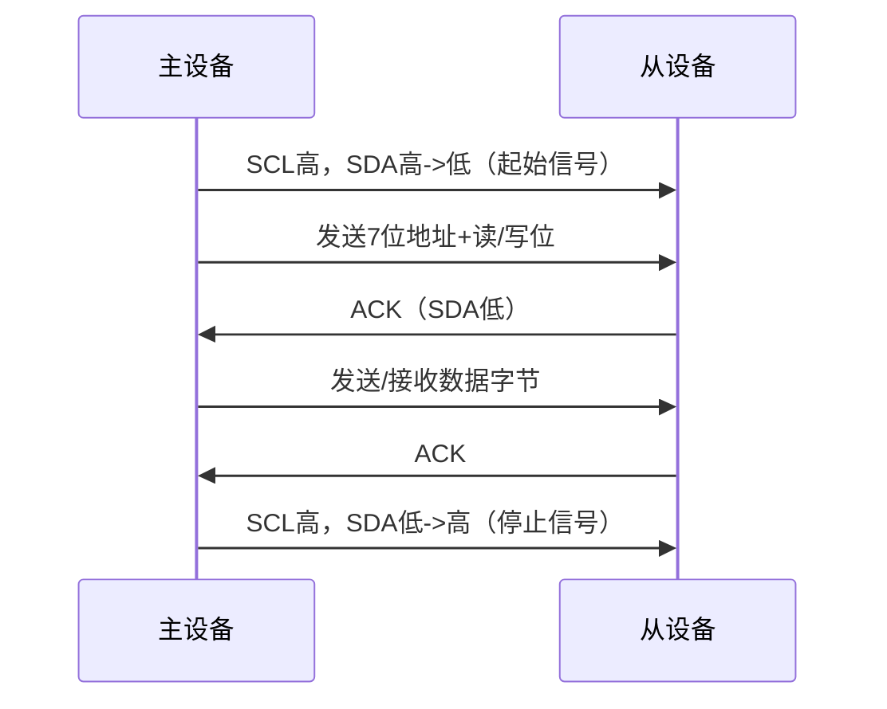
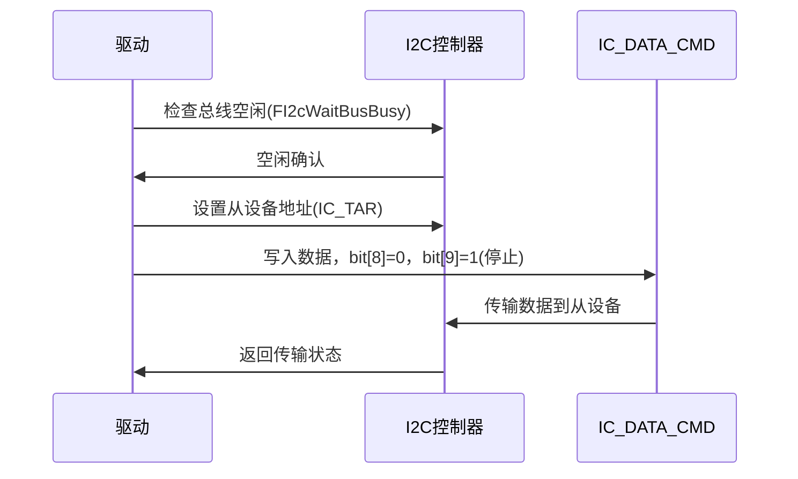

# 3.2 I2C驱动开发

## I2C介绍

I2C（Inter-Integrated Circuit）是一种两线制、低速串行通信协议，广泛用于嵌入式系统中微控制器与外设（如传感器、EEPROM）的通信，使用串行数据线（SDA）和串行时钟线（SCL）实现双向传输。

### 核心特性

- **两线制通信**：SDA传输数据，SCL提供时钟同步。
- **多主机多从机**：支持多个主设备发起通信，多个从设备通过唯一地址（7位或10位）响应。
- **传输模式**：支持标准模式（100kbps）、快速模式（400kbps）、快速模式加（1Mbps）和高速模式（3.4Mbps）。
- **简单连接**：仅需两根信号线，适合小型系统。
- **同步通信**：数据传输由SCL时钟控制，确保可靠性。

### 数据传输过程

I2C通信包括以下步骤：

1. **起始信号**：SCL高电平时，SDA从高到低跳变。
2. **地址和数据传输**：主设备发送7位/10位从设备地址和读/写位，SCL低电平时SDA传输8位数据+1位ACK/NACK。
3. **应答信号**：从设备在第9个SCL脉冲返回ACK（SDA低）或NACK（SDA高）。
4. **数据传输**：继续传输数据字节，每字节后有ACK/NACK。
5. **停止信号**：SCL高电平时，SDA从低到高跳变。

**I2C 数据传输过程**



**I2C传输模式**

| 模式       | 速率    | 应用场景           |
| ---------- | ------- | ------------------ |
| 标准模式   | 100kbps | 低速传感器、EEPROM |
| 快速模式   | 400kbps | 中速外设通信       |
| 快速模式加 | 1Mbps   | 较高性能需求       |
| 高速模式   | 3.4Mbps | 高性能嵌入式设备   |

## 飞腾派I2C硬件实现

飞腾派的I2C功能由MIO（多路输入输出）控制器实现，每个MIO可配置为I2C或UART，通过creg_mio_func_sel寄存器选择功能（00=I2C，01=UART）。I2C通信依赖PAD模块配置SCL和SDA引脚的电气特性。

### MIO控制器

- **功能**：支持I2C主模式通信，管理数据传输和中断。
- **基地址**：MIO0（0x28014000）至MIO15（0x28032000）。
- **配置**：creg_mio_func_sel设置功能，偏移地址需参考硬件手册。
- **中断**：每个MIO提供中断编号，处理传输完成或错误事件。

### PAD模块

- **功能**：配置引脚功能（如I2C）和电气特性（驱动强度、上下拉、延迟）。
- **基地址**：0x32B30000。
- **引脚**：SCL（偏移0x00D0）和SDA（偏移0x00D4）配置为I2C功能（值5）。

**飞腾派I2C硬件模块**

| 模块 | 功能                       | 基地址                |
| ---- | -------------------------- | --------------------- |
| MIO  | I2C/UART功能选择、数据传输 | 0x28014000–0x28032000 |
| PAD  | 引脚功能和电气特性配置     | 0x32B30000            |

## 飞腾派I2C驱动API调用表

| **API函数**          | **描述**                                                     | **参数**                                                     | **返回值**                                       |
| -------------------- | ------------------------------------------------------------ | ------------------------------------------------------------ | ------------------------------------------------ |
| FIOPadCfgInitialize  | 初始化PAD控制器，设置引脚基地址和设备ID，为SCL/SDA引脚配置做准备。 | instance_p: &mut FIOPadCtrl（PAD控制器实例） input_config_p: &FIOPadConfig（配置参数，包含基地址和ID） | bool：true（成功），false（已初始化或参数错误）  |
| FIOPadDeInitialize   | 去初始化PAD控制器，清除设备状态，标记未就绪。                | instance_p: &mut FIOPadCtrl（PAD控制器实例）                 | bool：true（成功）                               |
| FIOPadLookupConfig   | 根据设备ID查找PAD配置，返回基地址等信息。                    | instance_id: u32（设备ID）                                   | Option<FIOPadConfig>：配置结构体或None（ID无效） |
| FI2cMioMasterInit    | 初始化MIO和I2C控制器，配置MIO为I2C模式，设置SCL/SDA引脚、基地址、中断编号、时钟频率、从设备地址和速率。 | address: u32（从设备地址） speed_rate: u32（传输速率，如100kbps） | bool：true（成功），false（初始化失败）          |
| FI2cCfgInitialize    | 初始化I2C控制器，设置配置参数（如基地址、中断号），重置设备并标记就绪。 | instance_p: &mut FI2c（I2C实例） input_config_p: &FI2cConfig（配置参数） | bool：true（成功），false（已初始化或重置失败）  |
| FI2cMasterWrite      | 发送数据到从设备（如EEPROM），检查长度和偏移限制，执行轮询写操作。 | buf_p: &mut [u8]（数据缓冲区） buf_len: u32（数据长度） inchip_offset: u32（从设备内部偏移） | bool：true（成功），false（长度超限或写入失败）  |
| FI2cMasterStartTrans | 启动I2C主设备传输，设置从设备地址，向IC_DATA_CMD写入数据，配置读/写和停止标志。 | instance_p: &mut FI2c（I2C实例） mem_addr: u32（从设备内存地址） mem_byte_len: u8（地址字节数） flag: u16（控制标志，如停止位） | bool：true（成功），false（总线忙或FIFO错误）    |
| FI2cMasterRead       | 从设备读取数据，初始化缓冲区，执行轮询读操作。               | buf_p: &mut [u8]（接收缓冲区） buf_len: u32（数据长度） inchip_offset: u32（从设备内部偏移） | bool：true（成功），false（长度无效或读取失败）  |
| FI2cMasterStopTrans  | 停止I2C传输，检查停止条件，清空接收FIFO。                    | instance_p: &mut FI2c（I2C实例）                             | bool：true（成功），false（超时或总线忙）        |

### 说明

- **调用顺序**：
  1. 调用FIOPadCfgInitialize和FIOPadLookupConfig初始化PAD控制器，设置SCL/SDA引脚（偏移0x00D0/0x00D4，值5）。
  2. 调用FI2cMioMasterInit配置MIO为I2C模式，初始化I2C控制器。
  3. 调用FI2cCfgInitialize完成I2C配置，确保设备就绪。
  4. 使用FI2cMasterWrite或FI2cMasterRead进行数据传输。
  5. 调用FI2cMasterStopTrans结束传输。
- **硬件依赖**：
  - PAD基地址：0x32B30000。
  - MIO基地址：0x28014000（MIO0）至0x28032000（MIO15）。
  - I2C寄存器（如IC_DATA_CMD）用于数据和命令控制。
- **注意事项**：
  - 确保数据长度和偏移不超过从设备限制（如EEPROM的256字节）。
  - 检查总线状态（FI2cWaitBusBusy）和FIFO状态（IC_TXFLR/IC_RXFLR）。
  - 中断处理需开发者根据应用注册master_evt_handlers。

## ArceOS 的 I2C 驱动实现

MIO是一个包含多种控制器功能的多路选择控制器,飞腾派的每个MIO均可单独当做UART/I2C。端口功能的选择，可以通过配置creg_mio_func_sel寄存器来实现，配置为00选择I2C，配置为01选择UART。

```
由MIO控制器来当作IIC来与设备通信，操作会比普通单片机中用GPIO口模拟iic时序要复杂
```

由MIO控制的I2C操作说明：

### 初始化

#### 飞腾派 PAD 引脚初始化：

配置PAD控制器，设置SCL和SDA引脚为I2C功能，确保引脚电气特性适配外设。

```rust
// 定义PAD配置结构体
#[derive(Debug, Clone, Copy, Default)]
pub struct FIOPadConfig {
    pub instance_id: u32,    // 设备实例ID
    pub base_address: usize, // PAD基地址
}

// 定义PAD控制器结构体
#[feature(const_trait_impl)]
#[derive(Debug, Clone, Copy, Default)]
pub struct FIOPadCtrl {
    pub config: FIOPadConfig, // 配置信息
    pub is_ready: u32,        // 设备就绪状态
}

// 全局PAD控制器实例
pub static mut iopad_ctrl: FIOPadCtrl = FIOPadCtrl {
    config: FIOPadConfig {
        instance_id: 0,
        base_address: 0,
    },
    is_ready: 0,
};

// PAD配置表
static FIO_PAD_CONFIG_TBL: [FIOPadConfig; 1] = [FIOPadConfig {
    instance_id: 0,
    base_address: 0x32B30000usize,
}];

// 初始化PAD控制器
pub fn FIOPadCfgInitialize(instance_p: &mut FIOPadCtrl, input_config_p: &FIOPadConfig) -> bool {
    assert!(Some(instance_p.clone()).is_some(), "instance_p should not be null");
    assert!(
        Some(input_config_p.clone()).is_some(),
        "input_config_p should not be null"
    );
    let mut ret: bool = true;
    if instance_p.is_ready == 0x11111111u32 {
        debug!("Device is already initialized.");
    }
    // 去初始化并设置配置
    FIOPadDeInitialize(instance_p);
    instance_p.config = *input_config_p;
    instance_p.is_ready = 0x11111111u32;
    ret
}

// 去初始化PAD控制器
pub fn FIOPadDeInitialize(instance_p: &mut FIOPadCtrl) -> bool {
    if instance_p.is_ready == 0 {
        return true;
    }
    instance_p.is_ready = 0;
    unsafe {
        core::ptr::write_bytes(instance_p as *mut FIOPadCtrl, 0, size_of::<FIOPadCtrl>());
    }
    true
}

// 查找PAD配置
pub fn FIOPadLookupConfig(instance_id: u32) -> Option<FIOPadConfig> {
    if instance_id as usize >= 1 {
        return None;
    }
    for config in FIO_PAD_CONFIG_TBL.iter() {
        if config.instance_id == instance_id {
            return Some(*config);
        }
    }
    None
}
```

**说明**：

- FIOPadCfgInitialize：设置PAD基地址（0x32B30000），标记设备就绪（is_ready=0x11111111）。
- FIOPadDeInitialize：清除设备状态，防止重复初始化。
- FIOPadLookupConfig：根据实例ID查找配置，确保正确映射硬件资源。
- SCL（偏移0x00D0）和SDA（偏移0x00D4）通过FIOPadSetFunc配置为I2C功能（值5）。

#### MIO和I2C控制器初始化

配置MIO为I2C模式，初始化I2C控制器，包括基地址、中断编号、时钟频率等。

```rust
// 初始化MIO和I2C控制器
pub unsafe fn FI2cMioMasterInit(address: u32, speed_rate: u32) -> bool {
    let mut input_cfg: FI2cConfig = FI2cConfig::default();
    let mut config_p: FI2cConfig = FI2cConfig::default();
    let mut status: bool = true;
    // 初始化MIO控制器
    master_mio_ctrl.config = FMioLookupConfig(1).unwrap();
    status = FMioFuncInit(&mut master_mio_ctrl, 0b00); // 设置为I2C模式
    if status != true {
        debug!("MIO initialize error.");
        return false;
    }
    // 配置SCL和SDA引脚
    FIOPadSetFunc(&iopad_ctrl, 0x00D0u32, 5); /* scl */
    FIOPadSetFunc(&iopad_ctrl, 0x00D4u32, 5); /* sda */
    unsafe {
        core::ptr::write_bytes(&mut master_i2c_instance as *mut FI2c, 0, size_of::<FI2c>());
    }
    // 查找I2C默认配置
    config_p = FI2cLookupConfig(1).unwrap();
    if !Some(config_p).is_some() {
        debug!("Config of mio instance {} not found.", 1);
        return false;
    }
    // 设置I2C配置
    input_cfg = config_p.clone();
    input_cfg.instance_id = 1;
    input_cfg.base_addr = FMioFuncGetAddress(&master_mio_ctrl, 0b00);
    input_cfg.irq_num = FMioFuncGetIrqNum(&master_mio_ctrl, 0b00);
    input_cfg.ref_clk_hz = 50000000;
    input_cfg.slave_addr = address;
    input_cfg.speed_rate = speed_rate;
    // 初始化I2C控制器
    status = FI2cCfgInitialize(&mut master_i2c_instance, &input_cfg);
    // 设置中断处理函数
    master_i2c_instance.master_evt_handlers[0 as usize] = None;
    master_i2c_instance.master_evt_handlers[1 as usize] = None;
    master_i2c_instance.master_evt_handlers[2 as usize] = None;
    if status != true {
        debug!("Init mio master failed, ret: {:?}", status);
        return status;
    }
    debug!(
        "Set target slave_addr: 0x{:x} with mio-{}", input_cfg.slave_addr, 1
    );
    status
}

// 初始化I2C配置
pub fn FI2cCfgInitialize(instance_p: &mut FI2c, input_config_p: &FI2cConfig) -> bool {
    assert!(Some(instance_p.clone()).is_some() && Some(input_config_p).is_some());
    let mut ret = true;
    if instance_p.is_ready == 0x11111111u32 {
        debug!("Device is already initialized!!!");
        return false;
    }
    FI2cDeInitialize(instance_p);
    instance_p.config = *input_config_p;
    ret = FI2cReset(instance_p);
    if ret == true {
        instance_p.is_ready = 0x11111111u32;
    }
    ret
}
```

**说明**：

- FI2cMioMasterInit：设置MIO为I2C模式（creg_mio_func_sel=00），配置SCL/SDA引脚，初始化I2C控制器（基地址、中断号、50MHz时钟、从设备地址、速率）。
- FI2cCfgInitialize：检查设备状态，设置配置，重置I2C控制器，标记就绪。
- 中断处理函数初始化为空，开发者可根据需求注册。

### 收发数据

#### 数据发送

发送数据到从设备（如EEPROM），确保数据长度和偏移地址符合限制。

```rust
pub unsafe fn FI2cMasterWrite(buf_p: &mut [u8], buf_len: u32, inchip_offset: u32) -> bool {
    let mut status: bool = true;
    if buf_len < 256 && inchip_offset < 256 {
        if (256 - inchip_offset) < buf_len {
            debug!("Write to eeprom failed, out of eeprom size.");
            return false;
        }
    } else {
        debug!("Write to eeprom failed, out of eeprom size.");
        return false;
    }
    status = FI2cMasterWritePoll(&mut master_i2c_instance, inchip_offset, 1, buf_p, buf_len);
    if status != true {
        debug!("Write to eeprom failed");
    }
    status
}

pub fn FI2cMasterStartTrans(
    instance_p: &mut FI2c,
    mem_addr: u32,
    mem_byte_len: u8,
    flag: u16,
) -> bool {
    assert!(Some(instance_p.clone()).is_some());
    let base_addr = instance_p.config.base_addr;
    let mut addr_len: u32 = mem_byte_len as u32;
    let mut ret = true;
    ret = FI2cWaitBusBusy(base_addr.try_into().unwrap());
    if ret != true {
        return ret;
    }
    ret = FI2cSetTar(base_addr.try_into().unwrap(), instance_p.config.slave_addr);
    while addr_len > 0 {
        if FI2cWaitStatus(base_addr.try_into().unwrap(), (0x1 << 1)) != true {
            break;
        }
        if input_32(base_addr.try_into().unwrap(), 0x80) != 0 {
            return false;
        }
        if input_32(base_addr.try_into().unwrap(), 0x70) & (0x1 << 1) != 0 {
            addr_len -= 1;
            let value = (mem_addr >> (addr_len * 8)) & FI2C_DATA_MASK();
            if addr_len != 0 {
                output_32(base_addr.try_into().unwrap(), 0x10, value);
            } else {
                output_32(base_addr.try_into().unwrap(), 0x10, value + flag as u32);
            }
        }
    }
    ret
}
```

**说明**：

- FI2cMasterWrite：检查数据长度和偏移（<256字节），调用FI2cMasterWritePoll执行轮询写操作。
- FI2cMasterStartTrans：检查总线空闲（FI2cWaitBusBusy），设置从设备地址（IC_TAR），向IC_DATA_CMD（偏移0x10）写入数据（bit[8]=0表示写，bit[9]=1表示停止）。

#### 数据接收

```rust
pub unsafe fn FI2cMasterRead(buf_p: &mut [u8], buf_len: u32, inchip_offset: u32) -> bool {
    let mut instance_p: FI2c = master_i2c_instance;
    let mut status: bool = true;
    assert!(buf_len != 0);
    for i in 0..buf_len as usize {
        buf_p[i] = 0;
    }
    status = FI2cMasterReadPoll(&mut instance_p, inchip_offset, 1, buf_p, buf_len);
    status
}

pub fn FI2cMasterStopTrans(instance_p: &mut FI2c) -> bool {
    assert!(Some(instance_p.clone()).is_some());
    let mut ret = true;
    let base_addr = instance_p.config.base_addr;
    let mut reg_val = 0;
    let mut timeout = 0;
    while true {
        if input_32(base_addr.try_into().unwrap(), 0x34) & (0x1 << 9) != 0 {
            reg_val = input_32(base_addr.try_into().unwrap(), 0x60);
            break;
        } else if 500 < timeout {
            break;
        }
        timeout += 1;
        busy_wait(Duration::from_millis(1));
    }
    ret = FI2cWaitBusBusy(base_addr.try_into().unwrap());
    if ret == true {
        ret = FI2cFlushRxFifo(base_addr.try_into().unwrap());
    }
    ret
}
```

**说明**：

- FI2cMasterRead：初始化接收缓冲区，调用FI2cMasterReadPoll执行轮询读操作。
- FI2cMasterStopTrans：检查停止条件（IC_RAW_INTR_STAT的bit[9]），清空接收FIFO（FI2cFlushRxFifo），确保传输结束。

**飞腾派I2C数据发送**



## 飞腾派 I2C 和 MIO 寄存器信息

### I2C寄存器

| 寄存器           | 偏移 | 描述                                                 |
| ---------------- | ---- | ---------------------------------------------------- |
| IC_CON           | 0x00 | 控制寄存器，配置主/从模式、速率等                    |
| IC_TAR           | 0x04 | 主机目标地址，设置从设备地址                         |
| IC_SAR           | 0x08 | 从机地址寄存器，配置本设备地址                       |
| IC_HS_MADDR      | 0x0C | 高速模式地址编码                                     |
| IC_DATA_CMD      | 0x10 | 数据和命令，bit[7:0]=数据，bit[8]=读/写，bit[9]=停止 |
| IC_SS_SCL_HCNT   | 0x14 | 标准模式SCL高电平计数                                |
| IC_SS_SCL_LCNT   | 0x18 | 标准模式SCL低电平计数                                |
| IC_FS_SCL_HCNT   | 0x1C | 快速模式SCL高电平计数                                |
| IC_FS_SCL_LCNT   | 0x20 | 快速模式SCL低电平计数                                |
| IC_INTR_STAT     | 0x2C | 中断状态寄存器                                       |
| IC_INTR_MASK     | 0x30 | 中断屏蔽寄存器                                       |
| IC_RAW_INTR_STAT | 0x34 | 原始中断状态，bit[9]=停止检测                        |
| IC_CLR_INTR      | 0x40 | 清除中断寄存器                                       |
| IC_STATUS        | 0x70 | 状态寄存器，检查总线状态                             |
| IC_TXFLR         | 0x74 | 发送FIFO级别                                         |
| IC_RXFLR         | 0x78 | 接收FIFO级别                                         |
| IC_TX_ABRT_SRC   | 0x80 | 发送中止源，检查错误状态                             |

### MIO寄存器

| Name  | Offset          |
| ----- | --------------- |
| MIO0  | 0x000_2801_4000 |
| MIO1  | 0x000_2801_6000 |
| MIO2  | 0x000_2801_8000 |
| MIO3  | 0x000_2801_A000 |
| MIO4  | 0x000_2801_C000 |
| MIO5  | 0x000_2801_E000 |
| MIO6  | 0x000_2802_0000 |
| MIO7  | 0x000_2802_2000 |
| MIO8  | 0x000_2802_4000 |
| MIO9  | 0x000_2802_6000 |
| MIO10 | 0x000_2802_8000 |
| MIO11 | 0x000_2802_A000 |
| MIO12 | 0x000_2802_C000 |
| MIO13 | 0x000_2802_E000 |
| MIO14 | 0x000_2803_0000 |
| MIO15 | 0x000_2803_2000 |

### PAD寄存器

**基地址**：0x32B30000

| 寄存器 | 偏移                       | 描述                                  |
| ------ | -------------------------- | ------------------------------------- |
| x_reg0 | 0x00D0 (SCL), 0x00D4 (SDA) | 功能选择（值5=I2C），驱动强度，上下拉 |
| x_reg1 | 0x00D0 (SCL), 0x00D4 (SDA) | 输入/输出延迟，粒度100ps/366ps        |
