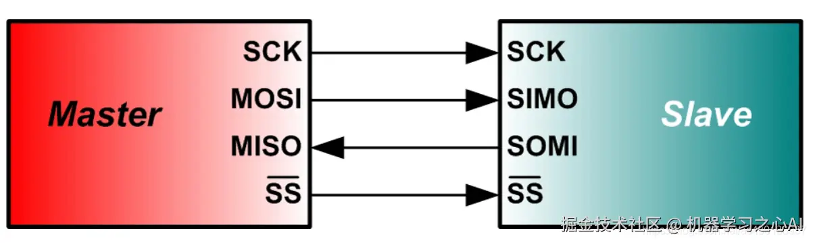
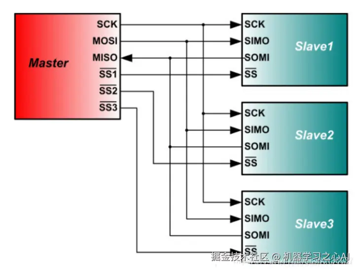
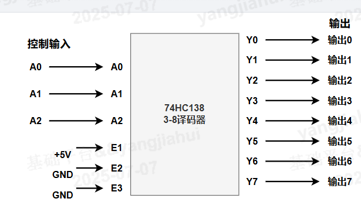
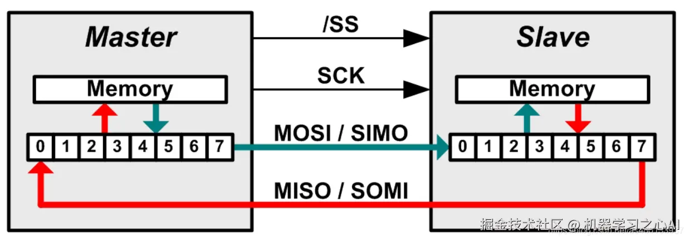
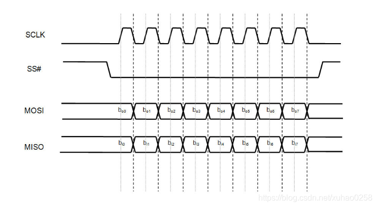

# 3.3 SPI驱动开发

## SPI介绍

**SPI（Serial Peripheral Interface）串行外围设备接口**是一种单主多从模式、**高速**、**全双工**同步串行总线，通常用在一些 flash、LCD 屏幕等设备的通信上。

---

**核心特性：**

**1. 四线制：SPI通信需要四根线：**
- **MISO**：主设备输入/从设备输出引脚。该引脚在从模式下发送数据，在主模式下接收数据。
- **MOSI**：主设备输出/从设备输入引脚。该引脚在主模式下发送数据，在从模式下接收数据。
- **SCK**：串行时钟信号，由主设备产生。
- **CS/SS**：从设备片选信号，由主设备控制。它的功能是用来作为“片选引脚”，也就是选择指定的从设备，让主设备可以单独地与特定从设备通讯，避免数据线上的冲突。

  

  

常见的连接方法有上面两种，还有一种额外电路所能实现的片选方案。众所周知三个引脚其实是存在8种状态，所以实际上可以利用译码器实现三个CS/SS控制8个SPI设备。

  

---

**2. 传输方式：数据交换**  
SPI 工作在主从模式下，但在每个时钟周期（Clock）内，主从设备都会**同时发送和接收 1 bit 数据**，实现真正的**全双工数据交换**。无论是主设备还是从设备，每个时钟周期都会有数据交换。  
主机进行写操作时，只需忽略接收到的字节；主机要读取从机的一个字节时，必须发送一个空字节来引发从机的传输。

  

---

**3. 传输规范：无速率限制无格式要求**  
SPI 没有严格的速度限制，一般实现通常能达到甚至超过 **100Mbps**，适合高速数据传输场景。  
SPI 没有指定的流控制，没有应答机制确认是否接收到数据。不像其他协议会有协议头、设备地址以及各种指令。只要四根信号线连接正确，SPI模式相同，将CS/SS信号线拉低，即可以直接通信。一次一个字节的传输，读写数据同时操作。  
所以 SPI 设备更适合一些适用流数据的设备，比如 LCD 屏幕、AD 转换器等。

---

**4. 4种传输模式：SCK采样**  
SPI 有四种模式简单理解就是上升沿下降沿采样和空闲时高电平与低电平，两两组合而出现的四种模式

- 模式0：CPOL= 0，CPHA=0。SCK串行时钟线空闲是为低电平，数据在SCK时钟的上升沿被采样
- 模式1：CPOL= 0，CPHA=1。SCK串行时钟线空闲是为低电平，数据在SCK时钟的下降沿被采样
- 模式2：CPOL= 1，CPHA=0。SCK串行时钟线空闲是为高电平，数据在SCK时钟的下降沿被采样
- 模式3：CPOL= 1，CPHA=1。SCK串行时钟线空闲是为高电平，数据在SCK时钟的上升沿被采样

以模式0为例子，下图为模式0下的SPI时序图

  

---

## 在普通单片机上的SPI通信可以简化为如下步骤

- 首先设置好SPI主机的模式
- 拉低SPI设备对应的片选信号CS/SS信号先
- SPI主机主动发送时钟SCK信号，表示数据交换开始

## 飞腾派上SPI实验
