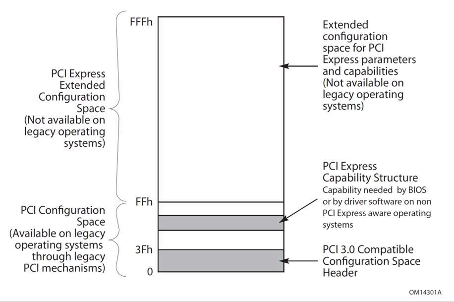
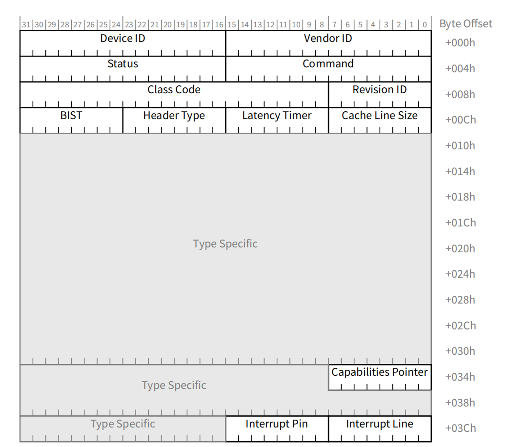

# PCIe基础知识

## 课程概述

本课程将介绍PCIe（Peripheral Component Interconnect Express）的基本知识，包括配置空间、地址空间、深度优先遍历等核心概念。

---

## 1. PCIe简介

[PCIe 5.0 文档](https://picture.iczhiku.com/resource/eetop/SYkDTqhOLhpUTnMx.pdf)

### 1.1 什么是PCIe

- PCIe是一种高速串行总线标准
- 替代了传统的PCI总线
- 采用点对点连接，支持全双工通信
- 具有更高的带宽和更好的扩展性

### 1.2 PCIe整体框图

PCIe的架构主要由五个部分组成：Root Complex，PCIe Bus，Endpoint，Port and Bridge，Switch


#### BDF(Bus Number, Device Number, Function Number)

PCIe上所有的设备，无论是Type 0还是Type 1，在系统启动的时候，都会被分配一个唯一的地址，它有三个部分组成：

Bus Number：8 bits，也就是最多256条总线
Device Number：5 bits，也就是最多32个设备
Function Number：3 bits，也就是最多8个功能

```sh
lspci -t -v
```

```bash
-[0000:00]-+-00.0  Intel Corporation Device 9b43
           +-01.0-[01]--+-00.0  NVIDIA Corporation GK208B [GeForce GT 730]
           |            \-00.1  NVIDIA Corporation GK208 HDMI/DP Audio Controller
           +-02.0  Intel Corporation CometLake-S GT2 [UHD Graphics 630]
           +-08.0  Intel Corporation Xeon E3-1200 v5/v6 / E3-1500 v5 / 6th/7th/8th Gen Core Processor Gaussian Mixture Model
           +-14.0  Intel Corporation Comet Lake PCH-V USB Controller
           +-14.2  Intel Corporation Comet Lake PCH-V Thermal Subsystem
           +-16.0  Intel Corporation Comet Lake PCH-V HECI Controller
           +-17.0  Intel Corporation 400 Series Chipset Family SATA AHCI Controller
           +-1b.0-[02]----00.0  Yangtze Memory Technologies Co.,Ltd Device 0071
           +-1c.0-[03]----00.0  Realtek Semiconductor Co., Ltd. RTL8111/8168/8411 PCI Express Gigabit Ethernet Controller
           +-1d.0-[04-05]----00.0-[05]--
           +-1f.0  Intel Corporation B460 Chipset LPC/eSPI Controller
           +-1f.2  Intel Corporation Memory controller
           +-1f.3  Intel Corporation Comet Lake PCH-V cAVS
           \-1f.4  Intel Corporation Comet Lake PCH-V SMBus Host Controller
```

Intel Corporation Comet Lake PCH-V USB Controller 的 BDF 是：0000:14.0

## 2. PCIe配置空间

### 2.1 配置空间概述

PCIe配置空间是用于存储设备配置信息的内存区域，每个PCIe设备都有自己的配置空间。

### 2.2 配置空间结构

配置空间大小：4KB（4096字节）



标准配置头



### 2.4 配置空间访问方法

1. **端口访问**
2. **内存映射访问**
3. **ECAM（Enhanced Configuration Access Mechanism）**
   

如果某个设备的BDF是`46:00.1`，ECAM基址是`0xE0000000`，那么其配置空间起始地址就是：`0xE0000000 + (0x46 << 20) | (0x00 << 15) | (0x01 << 12) = 0xE46001000`。

### Type 0设备


### Type 1设备


## 4. PCIe深度优先遍历

### 4.1 PCIe拓扑结构

### 4.2 总线编号机制

- Primary Bus Number（Pri）：这个Bridge所在的Bus Number，也就是它的上游连接的Bus Number
- Secondary Bus Number（Sec）：这个Bridge所连接的下一个Bridge的Bus Number
- Subordinate Bus Number（Sub）：这个Bridge所连接的下游所有的Bus的最大的Bus Number

### 4.3 深度优先遍历算法

### 4.4 遍历过程详解


#### 4.4.1 遍历步骤

1. **从根总线开始**：通常从总线0开始
2. **扫描设备**：遍历每个可能的设备号（0-31）
3. **检查功能**：对每个设备检查所有功能（0-7）
4. **识别桥设备**：通过Header Type识别桥设备
5. **递归遍历**：对桥设备的下游总线进行递归遍历

#### 4.4.2 设备识别流程

读取Vendor ID → 检查是否为0xFFFF → 存在则处理设备 → 检查Header Type → 如果是桥设备则递归遍历子总线