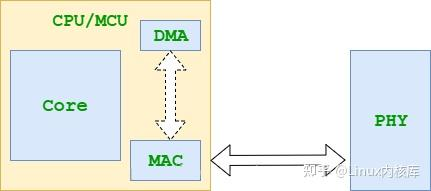
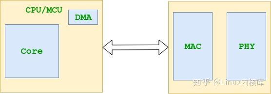
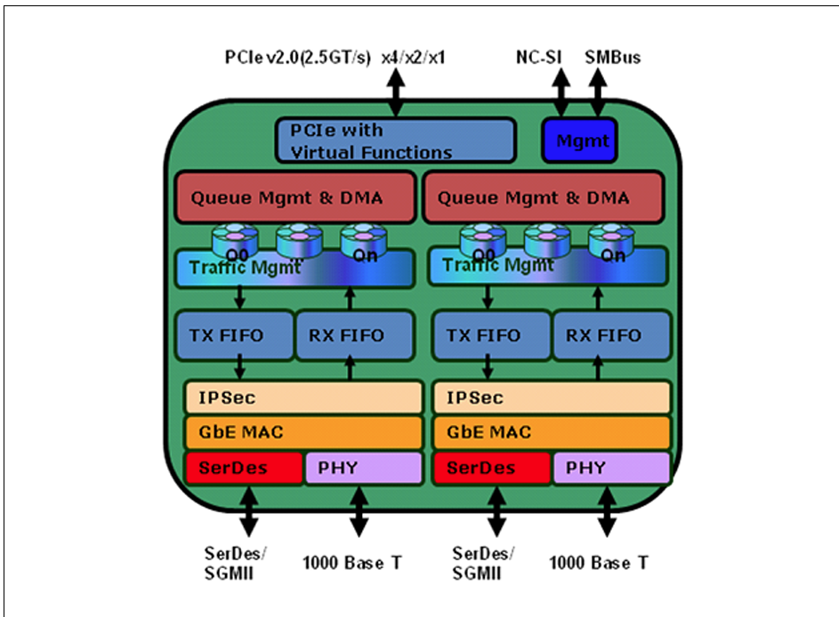
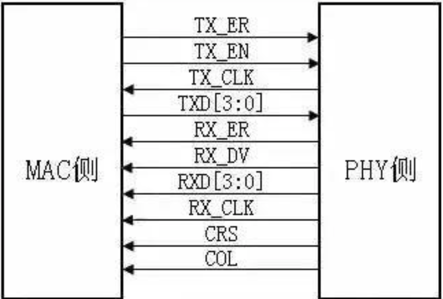

# IGB 网卡驱动

## 资料

[qemu igb文档](https://www.qemu.org/docs/master/system/devices/igb.html)

[igb网卡文档](https://www.intel.com/content/dam/www/public/us/en/documents/datasheets/82576eg-gbe-datasheet.pdf)

[linux igb驱动](https://github.com/torvalds/linux/tree/master/drivers/net/ethernet/intel/igb)

## 硬件架构

CPU集成MAC:

网卡包含MAC和PHY:

IGB网卡架构:

### MAC(Media Access Control)

### PHY(Physical Layer)

### MII(Media Independent Interface)

- 发送数据接口

- 接收数据接口

- MDIO：配置PHY芯片状态、读取寄存器、获取LINK状态等操作

RMII、GMII、RGMII、SGMII等都是MII的变种，主要区别在于数据传输速率和引脚数量。

## 驱动分析

### OSAL 操作系统抽象层

[trait-ffi](https://crates.io/crates/trait-ffi) 使用`trait`生成和安全使用外部函数。

### 驱动初始化

PCIe 枚举

手册阅读、寄存器定义

MAC定义

PHY定义

PHY寄存器读写

### Smoltcp

网络栈验证

### Request/Response 模型

### 收发数据

Ring

- Head

- Tail

Descriptor

- Read

- Write-Back

- Buffer

`Reqeust` 生命周期